# ECHAT: sistema di chat con cifratura end-to-end

## Frontespizio

| | |
|---|---|
| **Progetto** | ECHAT (Enterprise End-to-End Encrypted Chat) |
| **Tipo prova** | Prova Finale di Ingegneria del Software (gruppo da 2) |
| **Componenti** | Lorenzo Longiave (matricola 10599586, codice persona 959336) e Cassia Giorgio (matricola 10791325, codice persona 960554) |
| **Fascia voto richiesta** | 25–30 |
| **Repository** | [https://github.com/TheSmallPixel/IOL-ECHAT](https://github.com/TheSmallPixel/IOL-ECHAT) |
| **Documentazione live** | sito Docusaurus pubblicato dal repository; questo PDF è generato dallo stesso sorgente (`npm run pdf` in `docs-site`) |
| **Data** | A.A. 2025/2026, versione del 2026-06 |

## Sintesi del progetto

ECHAT è un sistema di messaggistica testuale e di scambio di file per organizzazioni che richiedono il pieno controllo dei propri dati, installato e gestito direttamente dall'organizzazione cliente. La proprietà di sicurezza dominante è la cifratura end-to-end: il server elabora soltanto dati cifrati e non possiede mai le chiavi di decifratura, quindi nemmeno un'entità che controlli completamente la macchina server può accedere ai contenuti. Il sistema supporta conversazioni di gruppo, gestione dinamica della membership con rotazione delle chiavi, allegati cifrati con anteprima in linea e una procedura di revoca dei diritti di accesso che rende la cronologia inaccessibile a un membro rimosso.

## Anteprime dell'interfaccia

Le immagini seguenti sono catturate da un'istanza in esecuzione del sistema e mostrano le funzionalità più caratterizzanti che saranno discusse formalmente nei capitoli successivi.


*Vista d'insieme.* La barra laterale a sinistra elenca le conversazioni di cui l'utente è membro; ciascuna voce mostra un indicatore di messaggi non letti sensibile al focus della finestra (vedi [§1.5 Reattività dell'interazione utente](#reattività-dellinterazione-utente)). L'area centrale mostra la conversazione attiva, con i messaggi resi nei tre formati supportati (`Plain`, `Markdown`, `Html`, vedi [F1.3](#per-lattore-user)). In basso il compositore di messaggio con selettore del formato, menzioni `@`, emoji, pulsanti *Send* e *AI* (risposta automatica, [F1.11](#per-lattore-user)).


*Verifica crittografica visibile.* Per ogni messaggio ricevuto sono mostrati quattro indicatori di verifica: `Decrypt: OK` (la decifratura del ciphertext è andata a buon fine), `MAC: OK` (il tag di autenticazione AES-GCM è coerente, vedi [§2.4.7](#247-echatclientcore--facade-crittografia-coda-di-invio-e-catena) `IChainValidator`), `Seq: OK` (il numero di sequenza è coerente con la prenotazione del lease, vedi [F1.5](#per-lattore-user)) e `Chain: OK` (il `prevEnvelopeHash` corrisponde all'hash dell'envelope precedente nella catena, vedi [§2.6.2 Ricezione di un messaggio](#262-ricezione-di-un-messaggio)). Sotto ai badge, i metadati di ingestion: `Seq`, `Type`, `MsgId` parziale, `Sender`. Una manomissione dell'envelope produce un badge in stato di errore: la verifica è sempre eseguita sul ricevente.

Le altre viste (allegati con anteprima CSV in linea decifrata nel Web Worker, compositore Markdown/HTML con iframe in sandbox, pannello admin con log di audit, impostazioni con backup della chiave) sono descritte in [§2.4.9](#249-echatclientapp--pagine-componenti-layout) e mostrate nella demo.

---

## Indice

1. [Requisiti del sistema](#1-requisiti-del-sistema)
2. [Progettazione del sistema](#2-progettazione-del-sistema)
3. [Piano di test](#3-piano-di-test)
4. [Rapporto sulla copertura dei test](#4-rapporto-sulla-copertura-dei-test)
5. [Versioning e pubblicazione](#5-versioning-e-pubblicazione)
6. [Glossario](#7-glossario)

---

## 1. Requisiti del sistema

### 1.1 Contesto applicativo

L'aumento delle violazioni di dati e la maggiore attenzione alla sovranità delle informazioni hanno reso evidente, in molte organizzazioni, l'esigenza di non delegare a fornitori terzi la propria messaggistica interna. Le piattaforme di chat commerciali offrono interfacce moderne ma memorizzano i contenuti in chiaro o cifrati con chiavi che il fornitore controlla, richiedono un canone per utente che diventa significativo sopra le decine di postazioni, e vincolano la giurisdizione del dato al cloud del fornitore.

ECHAT nasce per coprire questa lacuna: è un sistema client/server che l'organizzazione cliente esegue nella propria infrastruttura, dove il server vede soltanto dati cifrati e metadati minimi e dove nessun componente di sistema è in grado di leggere il contenuto dei messaggi.

Il prodotto è quindi posizionato come *prodotto installabile*: si distribuisce un eseguibile, lo si configura per il tenant, lo si aggiorna con cadenza di rilascio. Non si tratta di un servizio gestito.

### 1.2 Obiettivi

1. **Cifratura end-to-end ([E2EE](#crittografia-e-sicurezza))**: il server non deve mai disporre del testo in chiaro né di chiavi non protette dal trasporto.
2. **Esecuzione interna all'organizzazione**: l'organizzazione cliente esegue server e client nella propria infrastruttura senza dipendenze obbligatorie da servizi esterni. Le sole integrazioni esterne (autenticazione tramite Google OAuth e proxy verso OpenAI per la risposta automatica) sono opzionali e disattivabili.
3. **Conversazioni a due o più partecipanti** con membership variabile, rotazione delle chiavi e registro di audit completo.
4. **Integrità verificabile della cronologia**: ogni messaggio deve essere ordinato in modo monotono, autenticato e legato in catena al messaggio precedente.
5. **Revoca dei diritti di accesso**: alla rimozione di un membro, deve essere possibile rendere inaccessibile la cronologia tramite cancellazione delle chiavi crittografiche.
6. **Allegati cifrati** con anteprima in linea per i formati di uso comune (immagini, audio, video, documenti PDF, fogli CSV, contenuti HTML in sandbox).
7. **Manutenibilità**: il codice deve essere stratificato in moduli che il team possa evolvere indipendentemente.
8. **Testabilità**: la logica di business deve essere coperta da test automatici (vedi [§3](#3-piano-di-test) e [§4](#4-rapporto-sulla-copertura-dei-test)).

### 1.3 Stakeholder e attori

**User**: utente standard. Si autentica al sistema, partecipa alle conversazioni di cui è membro, invia e riceve messaggi e file.

**Admin**: amministratore di una conversazione. Aggiunge e rimuove membri, può attivare la procedura di revoca dei diritti di accesso, può promuovere altri utenti a Admin.

**Owner**: utente che ha creato la conversazione. Possiede tutte le capacità di un Admin con in più la facoltà di trasferire la proprietà a un altro membro.

**Moderator**: moderatore di una conversazione. Possiede il permesso `ModerateMessages` e può nascondere o ri-mostrare i messaggi altrui (E2EE-safe: il ciphertext non viene toccato), ma, a differenza di Admin/Owner, non può gestire membri né ruoli. Vale la regola di gerarchia: non si modera chi ha un ruolo superiore al proprio (Owner > Admin > Moderator > Member). I quattro ruoli di conversazione sono dunque Owner, Admin, Moderator e Member.

**Custodian**: specializzazione dell'attore Admin. È lo stesso essere umano dell'Admin, ma con il job-runner del custodian attivo sulla propria postazione. Da quel momento può eseguire le procedure di re-cifratura completa della cronologia, generazione di envelope `GapTombstone` per coprire i numeri di sequenza non utilizzati e distribuzione delle chiavi storiche ai nuovi membri.

**System Operator**: figura responsabile dell'installazione e della manutenzione del server. Configura le credenziali di autenticazione, il database e i parametri di retention. Non ha accesso ai contenuti delle conversazioni perché questi sono cifrati lato client.

**PlatformAdmin**: utente con ruolo globale di piattaforma (`Users.PlatformRole = PlatformAdmin`), distinto e ortogonale rispetto ai ruoli di conversazione (Owner/Admin/Moderator/Member). Gestisce gli utenti registrati (elenco, dettaglio, cambio del ruolo di piattaforma, attivazione e disattivazione), consulta le statistiche aggregate e il registro di audit. Non eredita dagli attori di conversazione e non ha accesso al contenuto dei messaggi (cifrato lato client): è un ruolo di autorizzazione separato, applicato dal filtro `[RequirePlatformAdmin]` (delega a `IPolicyEnforcer.AuthorizePlatformAsync`). A differenza del System Operator, che agisce sull'infrastruttura, il PlatformAdmin è un utente autenticato che opera *attraverso le API* applicative (`AdminController`).

Il sistema dialoga inoltre con due **sistemi esterni** che, in notazione UML, compaiono come *attori secondari* dei rispettivi casi d'uso (vedi [§2.2](#22-diagramma-dei-casi-duso)): il **Provider OAuth**, invocato dal caso d'uso *Autenticazione* per la verifica dell'identità dell'utente, e il **Modello generativo**, invocato dal caso d'uso *Generazione risposta automatica* quando questa funzionalità è attivata. In entrambi i casi è il sistema a contattare il servizio esterno, non viceversa.

### 1.4 Requisiti funzionali

#### Per l'attore User

- **F1.1: Autenticazione.** L'utente si autentica tramite il provider [OAuth](#identità-e-autorizzazione) configurato e riceve un token [JWT](#identità-e-autorizzazione) Bearer per le chiamate alle API.
- **F1.2: Lista conversazioni.** L'utente vede l'elenco delle conversazioni di cui è membro, con un indicatore numerico di messaggi non letti per ciascuna.
- **F1.3: Invio messaggio.** L'utente compone testo nei formati `Plain`, `Markdown` o `Html` e lo invia cifrato al server.
- **F1.4: Ricezione realtime.** L'utente riceve via canale push una notifica `MessageAvailable` e successivamente recupera il messaggio cifrato.
- **F1.5: Verifica della catena di integrità.** Il client verifica automaticamente, per ogni messaggio ricevuto, la catena di hash; eventuali manomissioni o lacune vengono segnalate alla UI.
- **F1.6: Allegati.** L'utente carica un file (per trascinamento o tramite selettore) cifrato lato client; in lettura, il file viene decifrato direttamente nel browser senza che il server abbia mai accesso al contenuto in chiaro.
- **F1.7: Anteprime in linea.** Il client renderizza in linea immagini, video, audio, documenti PDF, fogli CSV, contenuti HTML in iframe isolato e testo semplice.
- **F1.8: Scorrimento progressivo della cronologia.** L'utente può scorrere all'indietro nella cronologia di una conversazione; il client carica progressivamente le pagine più vecchie tramite [paginazione a cursore](#architettura-e-comunicazione).
- **F1.9: Notifiche.** L'utente riceve una notifica del browser e un segnale acustico quando arriva un messaggio in una conversazione che non è quella attualmente aperta o quando la finestra non ha il focus.
- **F1.10: Pannello impostazioni.** L'utente consulta i propri dati di account, l'impronta crittografica della chiave del dispositivo, il numero di messaggi nella coda di invio locale, e dispone di un comando per ripulire i dati locali.
- **F1.11: Attivazione della risposta automatica.** Per ciascuna conversazione l'utente può abilitare o disabilitare la generazione automatica di risposte. Quando la funzione è attiva, ogni messaggio in ingresso può innescare l'invio di un messaggio di risposta generato da un modello esterno tramite proxy server-side, dopo un breve intervallo casuale e a scopo demo.

#### Per l'attore Admin (e Owner)

- **F2.1: Creazione conversazione.** Riservato all'Owner. Crea una conversazione e ne imposta i partecipanti iniziali; il sistema genera la prima [chiave di conversazione (CEK)](#crittografia-e-sicurezza).
- **F2.2: Aggiunta membro.** L'Admin aggiunge un utente alla conversazione, eventualmente concedendogli accesso alla cronologia precedente.
- **F2.3: Rimozione membro.** L'Admin rimuove un membro; il sistema ruota l'[epoca crittografica](#architettura-e-comunicazione) per i partecipanti residui.
- **F2.4: Revoca dei diritti di accesso.** L'Admin avvia la procedura di rigenerazione delle chiavi e di [cancellazione di tutte le chiavi delle epoche precedenti](#crittografia-e-sicurezza). La cronologia diventa inaccessibile al membro rimosso anche in caso di accesso fisico al database.
- **F2.5: Re-cifratura completa.** Variante della procedura precedente, in cui il client del Custodian decifra la cronologia, la ricifra sotto la nuova chiave e la sovrascrive sul server.
- **F2.6: Trasferimento della proprietà.** Riservato all'Owner. Trasferisce il ruolo di Owner a un altro membro.
- **F2.7: Avanzamento del job di migrazione.** L'Admin segue via canale push (`JobProgress`) lo stato di avanzamento di una procedura di migrazione, con percentuale e indicazione della fase corrente (`Starting`, `Reencrypting`, `Finalizing`, `Completed`, `Cancelled`, `Failed`).
- **F2.8: Cancellazione del job di migrazione.** L'Admin può interrompere una saga in corso tramite l'endpoint `POST /api/conversations/{id}/migration/{jobId}/cancel`. La cancellazione è idempotente sugli stati terminali e *non* esegue il crypto-shred delle chiavi storiche.
- **F2.9: Finalizzazione forzata con perdita esplicita.** Quando una saga `FullReencrypt` non può essere completata (ad esempio perché il Custodian non possiede le CEK di tutte le epoche storiche), l'Admin può scegliere la finalizzazione forzata tramite `POST /api/conversations/{id}/migration/{jobId}/force-finalize`. La perdita di accesso agli envelope non re-cifrati è accettata in modo esplicito ed è registrata nel log di audit come `MigrationForceFinalized`.
- **F2.10: Consultazione del registro di audit.** L'utente con ruolo `PlatformAdmin` consulta il registro di audit tramite `GET /api/admin/audit`, con filtri opzionali per conversazione, utente, azione, finestra temporale e limite di risultati.

#### Per l'attore Moderator (e Admin/Owner)

- **F4.1: Moderazione di un messaggio.** Chi possiede il permesso `ModerateMessages` (Owner, Admin o Moderator) può nascondere (`hidden=true`) o ri-mostrare un messaggio tramite `POST /api/conversations/{id}/messages/{seq}/moderate`. Il "hide" è un flag server-side: il ciphertext non viene toccato e la catena di hash resta intatta; un client onesto mostra un placeholder. Si applica la regola di gerarchia: non si modera chi ha un ruolo superiore al proprio (Owner > Admin > Moderator > Member), mentre la moderazione del proprio messaggio è sempre consentita. L'operazione è registrata nel log di audit (`MessageHidden`/`MessageUnhidden`) e notificata in realtime ai membri tramite l'evento `MessageModeratedEvent`.

#### Per l'attore Custodian

- **F3.1: Esecuzione della revoca con rigenerazione delle chiavi.** Il Custodian scarica gli envelope storici, li decifra sotto la chiave di conversazione precedente, li ri-cifra sotto la chiave nuova e invia gli envelope sostitutivi al server tramite l'endpoint amministrativo `POST /messages/{seq}/replace`. La cifratura e la decifratura sono delegate al crypto worker JavaScript (`crypto-worker.js`, AES-GCM via WebCrypto) per non bloccare il thread principale dell'interfaccia.
- **F3.2: Generazione di GapTombstone.** Il Custodian inserisce envelope invisibili ([`GapTombstone`](#concetti-specifici-echat)) per coprire i numeri di sequenza che non sono mai stati utilizzati a causa di un [lease](#architettura-e-comunicazione) scaduto, mantenendo così integra la [catena di hash](#crittografia-e-sicurezza).
- **F3.3: Distribuzione delle chiavi storiche al nuovo membro.** Quando un nuovo membro entra con il flag `includeHistory`, il Custodian propaga al nuovo membro le chiavi delle epoche precedenti.
- **F3.4: Ri-wrapping delle DEK degli allegati.** Durante la procedura `FullReencrypt`, il Custodian riavvolge anche le DEK dei file allegati sotto la CEK della nuova epoca, garantendo che il MAC del payload resti coerente con il nuovo `wrappedFileDek`.


### 1.5 Requisiti non funzionali

I requisiti seguenti descrivono *proprietà osservabili* del sistema. La descrizione dei meccanismi che garantiscono tali proprietà è materia del capitolo [§2 Progettazione del sistema](#2-progettazione-del-sistema).

#### Riservatezza e integrità dei contenuti

Il sistema deve garantire la riservatezza del contenuto delle conversazioni anche di fronte a un'entità che disponga del controllo completo del server, del database o del filesystem dei blob. Il server deve essere in grado di operare le proprie funzioni di routing, ordinamento e deduplicazione utilizzando esclusivamente metadati e dati cifrati: in nessuna circostanza il server deve avere a disposizione il testo in chiaro dei messaggi né le chiavi di conversazione non protette dal canale di trasporto.

Il sistema deve inoltre garantire l'integrità della cronologia: una manomissione di un messaggio o l'omissione di un messaggio dalla sequenza devono essere rilevabili dal ricevente.

#### Disponibilità e tolleranza alle interruzioni di rete

Il sistema deve continuare a essere utilizzabile dal client in assenza temporanea di connettività. Specificamente: il client deve mantenere accessibile la cronologia già ricevuta, deve consentire la composizione di nuovi messaggi accodandoli in una coda di invio locale persistente, e deve recapitare automaticamente al server tutti i messaggi accodati al ripristino della connettività, garantendo che ogni messaggio sia consegnato esattamente una volta (idempotenza per `messageId`).

#### Reattività dell'interazione utente

L'interfaccia di chat deve risultare percepibilmente fluida durante le operazioni più frequenti. In particolare:

- l'invio di un messaggio testuale deve produrre la sua visualizzazione nella conversazione del mittente entro la soglia di percezione (al di sotto dei 100 ms tipicamente assunti come limite di latenza per un'azione UI);
- lo scorrimento della cronologia (caricamento di pagine più vecchie tramite paginazione a cursore) non deve introdurre stalli percepibili nella UI, anche su conversazioni con migliaia di messaggi;
- la cifratura e la decifratura di file di grandi dimensioni (decine o centinaia di MiB) non deve bloccare il thread principale dell'interfaccia, mantenendo la chat reattiva e lo scorrimento fluido durante l'operazione;
- l'apertura di una conversazione deve mostrare la cronologia più recente, con scorrimento automatico al messaggio più recente, prima del completamento del caricamento delle anteprime degli allegati.

#### Affidabilità del recapito

Il sistema deve garantire che ogni messaggio inviato dal client sia consegnato al server al massimo una volta nonostante eventuali ritrasmissioni dovute a errori di rete o riavvii del client. L'ordine di consegna ai destinatari deve essere coerente con l'ordine di ingestion al server (`seq` monotono per conversazione). Nel caso di crash del client durante l'invio di un messaggio già accodato in locale, il messaggio deve essere recapitato dopo il ripristino del client.

#### Manutenibilità

L'architettura del codice deve permettere l'evoluzione indipendente di logica di business, infrastruttura di persistenza, e infrastruttura di trasporto. Specificamente: la sostituzione del database relazionale o del meccanismo di trasporto realtime non deve richiedere modifiche alla logica di business; il porting del client a un'altra piattaforma di esecuzione (ad esempio MAUI in luogo di Blazor WebAssembly) non deve richiedere modifiche al codice condiviso con il server.

#### Testabilità

La logica di business deve essere espressa in classi prive di dipendenze dall'infrastruttura concreta (database, framework UI, browser API), in modo che possa essere esercitata da test automatici tramite mock. Il livello di copertura atteso sui moduli di logica di business è documentato in [§4](#4-rapporto-sulla-copertura-dei-test).

#### Portabilità

Il client deve essere eseguibile in qualunque browser conforme allo standard HTML5 con supporto a Web Workers, Web Crypto API, WebSocket e Web Storage. Il server deve essere eseguibile su qualsiasi piattaforma supportata dal runtime .NET 11 (Linux, Windows, macOS); la versione esatta del runtime è pinnata via `global.json` per garantire riproducibilità del build.

#### Tracciabilità

Il sistema deve mantenere un registro di audit append-only delle operazioni rilevanti per la sicurezza e per la membership: creazione di conversazioni, modifiche di membership, trasferimenti di ownership, caricamenti e download di file, avvii e completamenti di procedure di migrazione. Il registro deve essere conservato per un intervallo configurabile (predefinito: 90 giorni).

### 1.6 Vincoli e assunzioni

- **Browser cliente.** Il sistema assume che il browser disponga di Web Workers, Web Crypto API, WebSocket e Web Storage. I browser non conformi non sono supportati.
- **Provider di autenticazione.** L'implementazione iniziale del sistema utilizza Google OAuth come provider di identità. L'integrazione con altri provider conformi a OIDC è prevista come evoluzione, ma non è inclusa nel perimetro della versione corrente.
- **Esclusioni dalla versione corrente.** Le seguenti capability sono dichiarate fuori perimetro per non lasciarle nelle aspettative del lettore: autenticazione mutuale TLS (mTLS), single sign-on tramite SAML o Kerberos, autenticazione multifattore, certificate pinning, transport TCP custom in luogo di HTTP/2.
- **Distribuzione delle chiavi di conversazione.** La CEK è generata dal client (chi crea o ruota l'epoca) e distribuita per dispositivo tramite incapsulamento asimmetrico RSA-OAEP-2048: il server conserva solo i wrap cifrati e non ha mai accesso alla CEK in chiaro (dettagli in [§2.4.7](#247-echatclientcore--facade-crittografia-coda-di-invio-e-catena)).
- **Consultazione del registro di audit.** Il registro è popolato da controller e servizi con gli eventi rilevanti per sicurezza, membership e moderazione; la consultazione (`GET /api/admin/audit`, con filtri) è gated dal ruolo `PlatformAdmin`.

---

## 2. Progettazione del sistema

### 2.1 Vista d'insieme

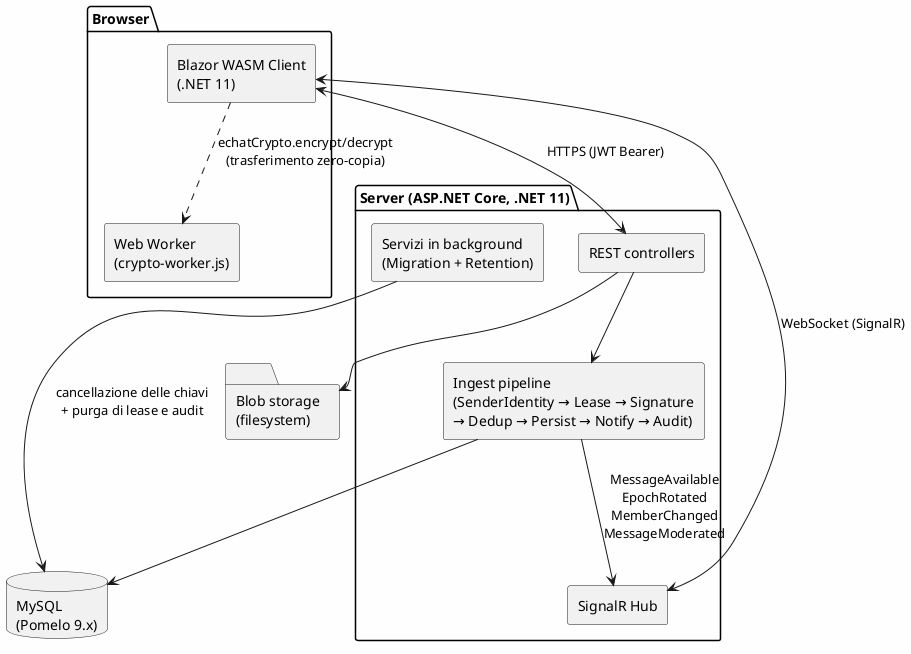

Il sistema è tripartito: un client WebAssembly eseguito nel browser, un server ASP.NET Core con un canale [REST](#architettura-e-comunicazione) per i comandi e un canale [WebSocket](#architettura-e-comunicazione) (SignalR) per la notifica realtime, e uno storage misto (MySQL per i metadati e i ciphertext dei messaggi, filesystem per i blob dei file). Il *[Web Worker](#concetti-specifici-echat)* è un componente del browser, dedicato all'esecuzione fuori dal thread principale, che esegue la cifratura [AES-GCM](#crittografia-e-sicurezza) dei file per evitare che operazioni su file di grandi dimensioni rendano la UI non reattiva. La pipeline di ingestion server-side (`SenderIdentity → Lease → Signature → Dedup → Persist → Notify → Audit`) è l'unico percorso per la persistenza di un messaggio: il server non decifra mai il ciphertext.

### 2.2 Diagramma dei casi d'uso

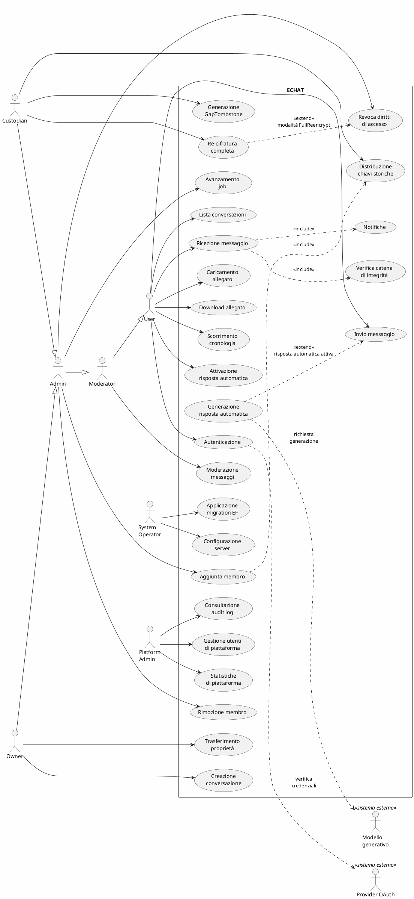

La gerarchia degli attori umani è una generalizzazione classica `User ← Moderator ← Admin ← Owner`: ogni grado eredita le capacità del precedente, quindi il caso d'uso *Moderazione messaggi* è accessibile a Moderator, Admin e Owner per ereditarietà. Il Custodian è una specializzazione dell'Admin (job-runner attivo sulla sua postazione) abilitata alle tre procedure amministrative specifiche: re-cifratura completa, generazione di GapTombstone, distribuzione delle chiavi storiche. Il System Operator è indipendente perché interagisce con l'infrastruttura (configurazione, migration EF), non con i contenuti. Anche il PlatformAdmin è indipendente, su un asse di autorizzazione *globale*: governa utenti, statistiche e registro di audit tramite l'`AdminController`, gated dal filtro `[RequirePlatformAdmin]`.

I due sistemi esterni `Provider OAuth` e `Modello generativo` compaiono come *attori secondari* dei rispettivi casi d'uso. Sono modellati a destra del rettangolo del sistema con `<<sistema esterno>>` e collegati ai casi d'uso che li invocano tramite dipendenza tratteggiata: è il sistema a contattare il servizio esterno in uscita. Il `Provider OAuth` partecipa al caso d'uso *Autenticazione* per la verifica delle credenziali dell'utente; il `Modello generativo` partecipa al caso d'uso *Generazione risposta automatica* quando questo viene innescato dall'invio di un messaggio in una conversazione in cui la risposta automatica è attiva.

Le relazioni tra casi d'uso che meritano commento sono quattro. `<<extend>>` da *Re-cifratura completa* verso *Revoca dei diritti di accesso*: la re-cifratura della cronologia è un'estensione opzionale della revoca, attiva solo in modalità `FullReencrypt`. `<<include>>` da *Aggiunta membro* verso *Distribuzione chiavi storiche*: con `includeHistory` la distribuzione delle chiavi delle epoche precedenti è parte integrante del flusso. `<<include>>` da *Ricezione messaggio* verso *Verifica catena di integrità*: la verifica avviene sul ricevente come passo obbligatorio della consegna. `<<extend>>` da *Generazione risposta automatica* verso *Invio messaggio*: si attiva solo se il toggle di risposta automatica è abilitato nella conversazione.

### 2.3 Diagramma dei package

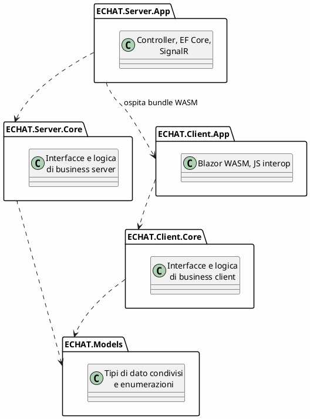

La regola architetturale è la seguente: il package `Models` non dipende da nulla; ogni package `*.Core` referenzia esclusivamente `Models`; ogni package `*.App` referenzia il proprio `*.Core`. Le frecce dirette `*.App ..> Models` non sono disegnate per non appesantire il diagramma: anche se i progetti App referenziano `Models` esplicitamente, la dipendenza è già implicata transitivamente attraverso `*.Core`. Non esistono dipendenze circolari. L'unica dipendenza che attraversa i due lati è `Server.App ..> Client.App`: il server ASP.NET Core ospita il bundle Blazor WASM del client (`UseBlazorFrameworkFiles` + `MapFallbackToFile("index.html")`) e referenzia perciò `Client.App` solo per servirne gli artefatti statici. Il client, invece, non vede mai il `Server.Core`.

Questa stratificazione segue lo schema architetturale Hexagonal (Ports-and-Adapters): la logica di business vive nei core, dove è esercitabile da test automatici tramite mock perché non importa né Blazor né EF Core; l'adattamento alla particolare tecnologia di persistenza, di trasporto realtime o di esecuzione browser è confinato nei package App. La conseguenza pratica è che cambiare MySQL con un altro database relazionale si fa sostituendo il provider EF nel solo `Server.App`; portare il client da Blazor a un'altra piattaforma tocca solo il `Client.App`.

### 2.4 Classi principali per package

#### 2.4.1 ECHAT.Models

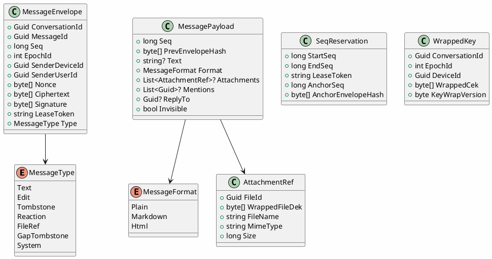

`MessageEnvelope` è la busta vista dal server (metadati di routing, `Ciphertext` opaco, firma); `MessagePayload` è il contenuto cifrato accessibile soltanto ai client. La duplicazione del campo `Seq` nei due tipi è intenzionale: il client verifica `payload.seq == envelope.seq` e l'[AEAD](#crittografia-e-sicurezza) include il `seq` negli [AAD](#crittografia-e-sicurezza), così che un attaccante non possa modificarlo senza rompere la decifratura. `SenderDeviceId` identifica il device che ha inviato il messaggio (chiave nella directory); `SenderUserId` è l'utente proprietario del device, validato server-side (S4, `SenderIdentityHandler`) confrontando con il claim JWT del richiedente. `Signature` è la firma ECDSA P-256 (IEEE-P1363, 64 byte) sul digest di `EnvelopeHasher`. `WrappedKey` rappresenta una chiave di conversazione cifrata per la tripla (conversazione, epoca, dispositivo) tramite RSA-OAEP-2048 (wire format `0xB2 | wrapped`, 257 byte).

#### 2.4.2 ECHAT.Server.Core: autorizzazione, sequenza, pipeline

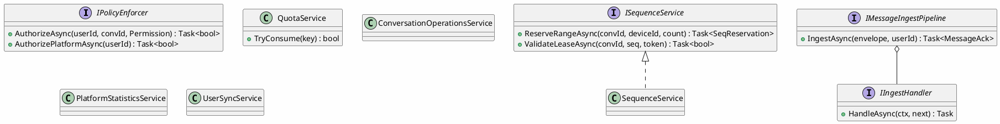

**Ordine della pipeline di ingest (la firma è verificata PRIMA della deduplication, così un envelope forgiato non entra mai nello store)**:
  1. **S4 SenderIdentityHandler**: `envelope.SenderUserId` == principal JWT e `SenderDeviceId` è un device registrato di quell'utente.
  2. **LeaseValidationHandler**: seq nel range del lease, token non scaduto, conversazione corretta.
  3. **S3 SignatureVerificationHandler**: firma ECDSA P-256 valida (via `EcdsaVerifier.VerifyP1363`) sul digest di `EnvelopeHasher` (che lega conv/msg/seq/epoch/senderDeviceId + ciphertext + nonce) contro la chiave pubblica SPKI della directory.
  4. **DeduplicationHandler**: `messageId` unico per conversazione (idempotenza).
  5. **PersistHandler**: append sul Message Store (UNIQUE su seq + messageId).
  6. **NotifyHandler** (fire-and-forget): fan-out realtime su SignalR .
  7. **AuditHandler** (fire-and-forget): log dell'operazione.

`QuotaService` applica il rate limiting prima dell'ingresso in pipeline; `ISequenceService` alloca i lease. L'autorizzazione è applicata in modo dichiarativo al confine HTTP dai due filtri MVC `[RequireConversationPermission(Permission)]` e `[RequirePlatformAdmin]`, che estraggono `userId` (claim) e `conversationId` (route) e delegano a `IPolicyEnforcer`, unica autorità RBAC, restituendo `403` *prima* dell'esecuzione dell'action. I tre servizi di orchestrazione in Core (`ConversationOperationsService`, `PlatformStatisticsService`, `UserSyncService`) sollevano i controller dalla logica di business e conservano le regole non esprimibili come permesso («l'Owner non può essere rimosso, nemmeno da un Admin»), propagando le eccezioni di dominio che il filtro globale mappa sui codici HTTP.

##### Ruoli e permessi della conversazione

Quattro ruoli per-conversazione (memorizzati in `Members.Role`), in ordine di grado: **Owner > Admin > Moderator > Member**. La matrice mostra quali `Permission` concede ogni ruolo (mappatura in `PolicyEnforcer.AuthorizeAsync`).

| Permesso (`Permission`) | Owner | Admin | Moderator | Member | Azione |
|---|:---:|:---:|:---:|:---:|---|
| `Read` / `Write` / `Upload` / `Download` | ✅ | ✅ | ✅ | ✅ | Leggere, inviare messaggi, caricare/scaricare allegati |
| `ModerateMessages` | ✅ | ✅ | ✅ | ❌ | Nascondere/ri-mostrare messaggi (moderazione) |
| `AddMember` / `RemoveMember` | ✅ | ✅ | ❌ | ❌ | Aggiungere/rimuovere membri |
| `Admin` | ✅ | ✅ | ❌ | ❌ | Operazioni admin (es. replace durante `FullReencrypt`) |
| `ManageRoles` | ✅ | ❌ | ❌ | ❌ | Assegnare ruoli (Admin/Moderator/Member) |
| `TransferOwnership` | ✅ | ❌ | ❌ | ❌ | Trasferire la proprietà della conversazione |
| `DeleteConversation` | ✅ | ❌ | ❌ | ❌ | Cancellare la conversazione (crypto-shred) |

Il **Moderator** è il ruolo intermedio: ha esattamente un permesso in più del Member (`ModerateMessages`) e nessun potere amministrativo. Oltre al permesso, `MessageModerationService` applica una **regola di gerarchia**: si può nascondere solo un messaggio il cui mittente ha ruolo **≤** al proprio (il proprio messaggio sempre). «Hide» è reversibile e **non distrugge il ciphertext** (flag server-side, catena intatta): l'enforcement è lato client onesto, non cancellazione crittografica.

#### 2.4.3 ECHAT.Server.Core: persistenza, gestione delle chiavi e saga di migrazione

```plantuml
@startuml
skinparam backgroundColor #FEFEFE

package "Persistenza dei contenuti" {
  interface IMessageRepository {
    +AppendAsync(envelope) : Task
    +QueryAsync(convId, after, before, limit) : Task<List<MessageEnvelope>>
    +ReplaceAsync(seq, envelope) : Task
    +GetMaxSeqAsync(convId) : Task<long>
  }
  interface IBlobStorageService
  interface ISeqCounterStore
  interface ISeqLeaseStore
}

package "Persistenza di dominio" {
  interface IConversationReader
  interface IConversationStore
  interface IMemberStore
  interface IUserStore
  interface IAuditLog
}

package "Directory e chiavi" {
  interface IDevicePublicKeyStore {
    +GetActiveByDeviceAsync(deviceId) : Task<DevicePublicKeyRecord?>
    +GetActiveForUserAsync(userId) : Task<List<DevicePublicKeyRecord>>
    +GetActiveForUsersAsync(userIds) : Task<List<DevicePublicKeyRecord>>
    +UpsertAsync(record) : Task
  }
  class DeviceDirectoryService
  class KeyAccessService
  interface IKeyEnvelopeStore {
    +GetKeysAsync(...) : Task<List<WrappedKey>>
    +StoreWrapsAsync(...) : Task
    +DeleteWrapsAsync(...) : Task
  }
}

package "Saga di migrazione" {
  interface IMigrationOrchestrator {
    +StartMigrationAsync(convId, mode, custodianUserId) : Task<Guid>
    +CheckpointAsync(convId, jobId, batchId, progressPercent) : Task
    +FinalizeAsync(convId, jobId) : Task
    +ForceFinalizeAsync(convId, jobId) : Task
    +CancelAsync(convId, jobId) : Task
    +GetActiveFullReencryptJobAsync(convId) : Task<MigrationJobRecord?>
    +RecordReplacementAsync(jobId, seq) : Task
  }
  interface IMigrationJobStore
  interface IRealtimeNotifier
  interface IChainBoundaryStore {
    +AddAsync(convId, afterSeq, atEpoch) : Task
    +ListAsync(convId) : Task<List<ChainBoundaryRecord>>
  }
  class MigrationOrchestratorService
  class ChainBoundaryStore
}

DeviceDirectoryService --> IDevicePublicKeyStore
KeyAccessService --> IKeyEnvelopeStore
KeyAccessService --> IMemberStore
IMigrationOrchestrator <|.. MigrationOrchestratorService
MigrationOrchestratorService --> IMigrationJobStore
MigrationOrchestratorService ..> IRealtimeNotifier
MigrationOrchestratorService --> IChainBoundaryStore
@enduml
```

Il diagramma raccoglie tre famiglie di interfacce: la persistenza dei contenuti (`IMessageRepository` come unico percorso di scrittura sul Message Store; `IBlobStorageService`, `ISeqCounterStore`, `ISeqLeaseStore`, `IChainBoundaryStore`), la persistenza di dominio (`IConversationReader`/`Store`, `IMemberStore`, `IUserStore`, `IAuditLog`) e la gestione delle chiavi accoppiata alla saga di migrazione. `ReplaceAsync` e `CountByEpochBelowAsync` di `IMessageRepository` esistono solo per il percorso di re-cifratura completa ([§2.6.6](#266-revoca-con-re-cifratura-completa-modalità-fullreencrypt)).

`KeyAccessService` orchestra l'accesso alle CEK: il server NON genera, copia né deriva alcuna chiave; serve i wrap cifrati depositati dai client e ne accetta di nuovi (validando membro attivo, forma del blob 257 byte/`0xB2`, versione del wrap). `DeviceDirectoryService` gestisce la directory delle chiavi pubbliche per device. `IMigrationOrchestrator` realizza la modalità `FullReencrypt` (la `RewrapOnly` non ha lavoro server-side: epoch bump e crypto-shred dei wrap del rimosso avvengono in `RemoveMemberAsync`, la nuova CEK è wrappata client-side): `StartMigrationAsync` rifiuta gli altri mode con `ValidationException` e registra il `custodianUserId` per il gating di `/replace`; `FinalizeAsync` esegue il pre-check anti data-loss, cancella le chiavi storiche e scrive il `ChainBoundary`; `ForceFinalizeAsync` bypassa il pre-check accettando la perdita (log `WARNING` + audit); `CancelAsync` chiude senza shred. Le transizioni sono idempotenti sugli stati terminali e le scritture su `MigrationJobs.Status` sono protette da `[ConcurrencyCheck]` (wrapper `TrySaveAsync`). Le implementazioni EF Core stanno in `Server.App.Repositories`.

#### 2.4.4 ECHAT.Server.App: vista funzionale

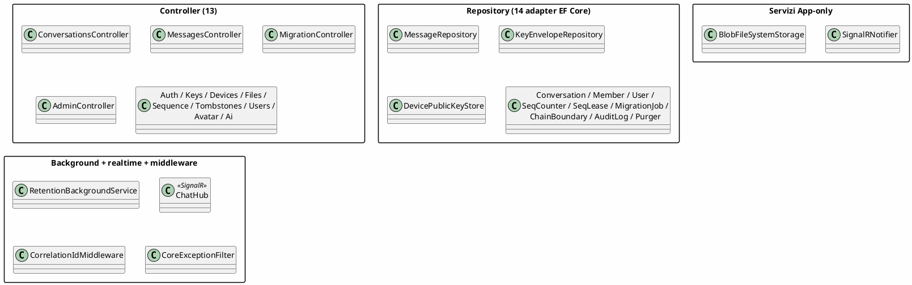

Il `Server.App` implementa le interfacce del `Server.Core` con tecnologie concrete (EF Core, SignalR, filesystem). I controller sono sottili adapter HTTP che validano l'input e delegano al Core; gli handler di pipeline sono definiti in Core e qui solo registrati nella DI. `SignalRNotifier` risolve i destinatari a ogni invio interrogando la membership attiva, così un utente appena rimosso smette immediatamente di ricevere eventi anche con una connessione `ChatHub` ancora aperta (hub `[Authorize]`, instradamento per `Clients.Users(...)`); `BlobFileSystemStorage` realizza lo storage con rinominazione atomica; `RetentionBackgroundService` esegue la purga periodica fuori dal thread di richiesta; `CoreExceptionFilter` mappa le eccezioni di dominio sui codici HTTP (`Conflict` → 409, `Forbidden` → 403, `NotFound` → 404, `ConcurrencyConflict` → 409, `Validation` → 400).

#### 2.4.5 ECHAT.Server.App: persistenza

Tutti i quattordici repository del diagramma precedente condividono lo stesso `EchatDbContext` (MySQL via provider Pomelo) e sono adapter EF Core che restituiscono record DTO definiti in `Server.Core.Interfaces`: le entity EF non escono mai dall'`App`. `MessageRepository` realizza il [Message Store](#concetti-specifici-echat) [append-only](#architettura-e-comunicazione) con il vincolo `UNIQUE(ConversationId, Seq)` come dedup-by-seq autoritativo; `ChainBoundaryStore` persiste i punti di ripartenza della catena di hash generati dalle sostituzioni `FullReencrypt`; `BlobFileSystemStorage` realizza lo storage dei blob con commit atomico tramite rinominazione della directory temporanea. Lo schema relazionale sottostante è documentato dal modello entità-relazione che segue.

#### 2.4.6 Modello entità-relazione del database

Lo schema del database MySQL gestito da `EchatDbContext` è composto da dodici tabelle. Il diagramma mostra le relazioni logiche fra le tabelle e i vincoli di unicità rilevanti.

```plantuml
@startuml
skinparam backgroundColor #FEFEFE
skinparam linetype polyline
skinparam nodesep 15
skinparam ranksep 25
hide circle
hide methods

together {
  entity Users {
    * Id : Guid <<PK>>
    --
    * GoogleSubjectId : string <<UQ>>
    * Email : string <<UQ>>
    * DisplayName : string
    * IsActive : bool
    * PlatformRole : string
  }
  entity DevicePublicKeys {
    * Id : long <<PK>>
    --
    * UserId : Guid <<FK Users>>
    * DeviceId : Guid
    * RsaOaepSpki : byte[]
    * EcdsaSpki : byte[]
    RevokedAt : DateTime?
  }
  entity Members {
    * Id : long <<PK>>
    --
    * ConversationId : Guid <<FK>>
    * UserId : Guid <<FK Users>>
    * Role : string
    RemovedAt : DateTime?
    .. UNIQUE(ConversationId, UserId) ..
  }
  entity AuditLog {
    * Id : long <<PK>>
    --
    * ConversationId : Guid <<FK>>
    UserId : Guid? <<FK Users>>
    * Action : string
    * Timestamp : DateTime
    Details : string?
  }
}

entity Conversations {
  * Id : Guid <<PK>>
  --
  * Name : string
  * CreatedByUserId : Guid <<FK Users>>
  * CurrentEpochId : int
  * CreatedAt : DateTime
}

together {
  entity Messages {
    * Id : long <<PK>>
    --
    * ConversationId : Guid <<FK>>
    * MessageId : Guid <<UQ>>
    * Seq : long <<UQ con ConvId>>
    * EpochId : int
    * SenderDeviceId : Guid
    * SenderUserId : Guid
    * Nonce : byte[]
    * Ciphertext : byte[]
    * Signature : byte[]
    * LeaseToken : string
    * Type : MessageType
    * IsHidden : bool
    ModeratedByUserId : Guid?
  }
  entity KeyEnvelopes {
    * Id : long <<PK>>
    --
    * ConversationId : Guid <<FK>>
    * EpochId : int
    * DeviceId : Guid
    * WrappedCek : byte[]
    * KeyWrapVersion : byte
    .. UNIQUE(ConversationId, EpochId, DeviceId) ..
  }
  entity Files {
    * Id : long <<PK>>
    * FileId : Guid <<UQ>>
    --
    * ConversationId : Guid <<FK>>
    * Status : string
    * UploadToken : string
    * MetaCiphertext : byte[]
    FilePath : string?
    * Size : long
    * Hash : byte[]
  }
}

together {
  entity SeqCounters {
    * ConversationId : Guid <<PK, FK>>
    --
    * NextSeq : long
    * AnchorSeq : long
    * AnchorEnvelopeHash : byte[]
  }
  entity SeqLeases {
    * Id : long <<PK>>
    * LeaseToken : string <<UQ>>
    --
    * ConversationId : Guid <<FK>>
    * DeviceId : Guid
    * StartSeq : long
    * EndSeq : long
    * ExpiresAt : DateTime
  }
  entity MigrationJobs {
    * Id : Guid <<PK>>
    --
    * ConversationId : Guid <<FK>>
    * CustodianUserId : Guid <<FK Users>>
    * Mode : string
    * Status : string <<ConcurrencyCheck>>
    * MaxReplacedSeq : long
  }
  entity ChainBoundaries {
    * Id : Guid <<PK>>
    --
    * ConversationId : Guid <<FK>>
    * AfterSeq : long
    * AtEpoch : int
  }
}

Users ||--o{ Conversations
Users ||--o{ DevicePublicKeys
Users ||--o{ Members
Users ||--o{ AuditLog
Users ||--o{ MigrationJobs
Conversations ||--o{ Members
Conversations ||--o{ Messages
Conversations ||--o{ KeyEnvelopes
Conversations ||--o{ Files
Conversations ||--|| SeqCounters
Conversations ||--o{ SeqLeases
Conversations ||--o{ MigrationJobs
Conversations ||--o{ ChainBoundaries
Conversations ||--o{ AuditLog
@enduml
```

Tutte le tabelle usano una chiave primaria surrogata (`Id`); le chiavi naturali sono vincoli di unicità o indici. I vincoli di consistenza rilevanti: `Messages` ha `UNIQUE(ConversationId, Seq)` come dedup-by-seq autoritativo e `UNIQUE(MessageId)` per l'idempotenza dell'invio; `Members` ha `UNIQUE(ConversationId, UserId)` con soft-delete via `RemovedAt`; `KeyEnvelopes`, con indice univoco su `(ConversationId, EpochId, DeviceId)`; `SeqCounters` (1:1 con `Conversations`) contiene l'ancora della catena di hash. Su `MigrationJobs`, `Status` ha `[ConcurrencyCheck]` (un checkpoint in ritardo non può riportare `InProgress` un job già `Cancelled`), `CustodianUserId` lega il job all'identità che lo ha avviato per il gating di `/replace`, e `MaxReplacedSeq` alimenta la scrittura del `ChainBoundary` al finalize. `Users.GoogleSubjectId` ed `Email` sono univoci (collegamento al provider OAuth). Lo schema è versionato come migration EF (`Data/Migrations`).

#### 2.4.7 ECHAT.Client.Core: facade, crittografia, coda di invio e catena {#247-echatclientcore--facade-crittografia-coda-di-invio-e-catena}

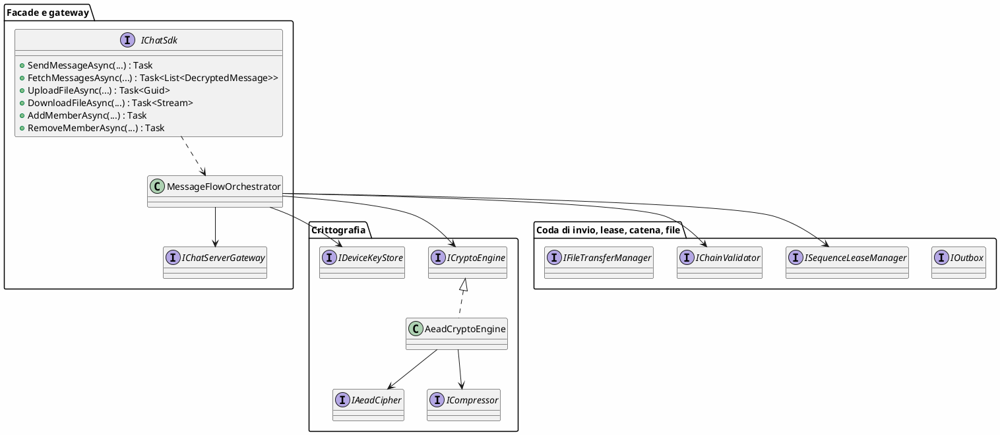

`IChatSdk` è il punto d'ingresso della UI; tutta la logica vive in `MessageFlowOrchestrator` (Core), che mantiene la cache CEK, costruisce gli envelope cifrati, valida la catena al fetch e coordina i collaboratori. L'I/O verso il server passa per la porta astratta `IChatServerGateway` (implementazione HTTP nel `Client.App`). `ICryptoEngine` (implementato da `AeadCryptoEngine`) compone i primitivi sostituibili `IAeadCipher` (AES-GCM) e `ICompressor` (gzip): in produzione il cipher gira su WebCrypto (`JsAeadCipher`), nei test C# è un fake round-trip. `EncryptAsync` lega il ciphertext al contesto tramite AAD (`conversationId|messageId|seq|epochId`); l'identità del mittente è invece autenticata dalla firma ECDSA P-256 (IEEE-P1363) sul digest di `EnvelopeHasher`, che include il `SenderDeviceId` ed è contemporaneamente l'anello della catena (`prevEnvelopeHash`). `IOutbox` è la macchina a stati persistita in Web Storage; `ISequenceLeaseManager` la cache locale dei lease; `IFileTransferManager` orchestra caricamento e download.

`IChainValidator` verifica **in ricezione** seq, `prevEnvelopeHash` e la **firma ECDSA del mittente** contro la chiave pubblica del device nella directory (la decifratura con tag GCM è già coperta dall'eccezione di `DecryptAsync`): il MAC simmetrico resta nel tag AES-GCM, la firma del messaggio è asimmetrica.

`IDeviceKeyStore` (facade asincrona su WebCrypto/IndexedDB) gestisce le coppie di chiavi estraibili del device (RSA-OAEP-2048 per wrap/unwrap della CEK, ECDSA P-256 per firma/verifica) con `EnsureDeviceAsync` (enrollment + registrazione in directory), `SignHashAsync`/`VerifySignatureAsync` e `WrapCekAsync`/`UnwrapCekAsync`; l'implementazione `LocalStorageDeviceKeyStore` persiste le CryptoKey in IndexedDB (esportabili nel file di backup). **CekProvisioner** genera e distribuisce le CEK (incarico che in precedenza era del server): alla creazione o alla rotazione d'epoca genera una CEK fresca da 32 byte e la wrappa per ogni device dei membri attuali; all'aggiunta di un membro ri-wrappa la CEK corrente per tutti i device. Il modello attuale prevede un wrap per utente.

#### 2.4.8 ECHAT.Client.Core: canale realtime, custodian, dispositivo

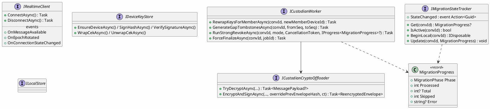

`IRealtimeClient` espone il canale SignalR come sette eventi tipizzati (`OnMessageAvailable`, `OnEpochRotated`, `OnMemberChanged`, `OnMessageModerated`, `OnConversationChanged`, `OnJobProgress`, `OnConnectionStateChanged`). `ICustodianWorker` (in Core) raggruppa le operazioni amministrative: ridistribuzione delle chiavi storiche, generazione di `GapTombstone` e la saga `RunStrongRevokeAsync`, che per `FullReencrypt` è una pipeline a tre stage (decifratura parallela, ri-cifratura seriale per il rebuild della catena, POST parallelo delle sostituzioni); la crittografia per envelope è delegata a `ICustodianCryptoOffloader`, la cui unica implementazione `ICryptoEngine` (gira comunque nel `crypto-worker.js`) e `FileCipher` per il re-wrap delle DEK. I progressi raggiungono il chiamante via `IProgress<MigrationProgress>` e le altre tab via SignalR; `IMigrationStateTracker` traccia la fase per conversazione, abilita il gating del compositore durante una migrazione e mantiene lo stato terminale per ~2.5 s. `ILocalStore` è la cache cifrata client-side; per la risposta automatica `IAiReplyGenerator` astrae la chiamata al modello e `AiReplyComposer` costruisce il prompt. (`IDeviceKeyStore` è descritto in [§2.4.7](#247-echatclientcore--facade-crittografia-coda-di-invio-e-catena).)

#### 2.4.9 ECHAT.Client.App: pagine, componenti, layout {#249-echatclientapp--pagine-componenti-layout}

L'interfaccia è composta da cinque pagine (`Login`, `Chat`, `Conversations`, `Settings`, `Admin`) e tre componenti riusabili (`MessageBubble`, `AttachmentPreview`, `MembershipPanel`), tutte visibili nelle anteprime in apertura del documento; le pagine delegano tutta la logica all'`IChatSdk`. `MainLayout.razor` è il componente cardine: sottoscrive `OnMessageAvailable` a livello applicativo, gestisce indicatore di non-letto, notifiche di sistema e tracciamento del focus, e ospita la sidebar di navigazione. `AttachmentPreview.razor` realizza la macchina `Pending → Loading → Loaded / Error` con gestori specializzati per ogni tipo MIME (immagine, video, audio, CSV in linea, PDF in iframe, HTML in iframe-sandbox, testo). `Admin.razor` espone il pannello di gestione degli utenti e il visualizzatore del log di audit con filtri; `Chat.razor` mostra un banner colorato per la fase corrente della saga di migrazione (driven da `IMigrationStateTracker`) con pulsante *Cancel* e, su `Failed`, *Force-Finalize*.

#### 2.4.10 ECHAT.Client.App: implementazioni dei servizi

Le implementazioni del `Client.App` sono adapter dipendenti da `HttpClient`, JSInterop o `NavigationManager` (le relazioni con il bridge JavaScript sono nel diagramma di [§2.4.11](#2411-echatclientapp--integrazione-javascript-e-web-worker)). `ChatSdkService` delega il flusso al `MessageFlowOrchestrator` di Core e orchestra l'`IMigrationStateTracker` (gating del `SendMessageAsync` a saga in corso); `HttpChatServerGateway` traduce `IChatServerGateway` in HTTP REST con `Authorization: Bearer`; `JsAeadCipher` instrada AES-GCM su WebCrypto via `IJSRuntime` per messaggi e wrap delle DEK, mentre firme ECDSA e wrap RSA della CEK passano per `LocalStorageDeviceKeyStore` (`window.echatCrypto`). `WorkerFileEncryptor` cifra i corpi dei file nel Web Worker (AES-GCM hardware-accelerated, molto più rapido di una cifratura su CLR/WASM). Completano lo strato `SignalRRealtimeClient`, `MigrationStateTracker` (propagazione cross-tab + linger), `TokenAuthStateProvider`, `LocalStorage*Store`, `HttpFileTransferManager` (chunk da 2 MiB × 4 parallele) e `AiAutoReplyService`.

#### 2.4.11 ECHAT.Client.App: integrazione JavaScript e Web Worker {#2411-echatclientapp--integrazione-javascript-e-web-worker}

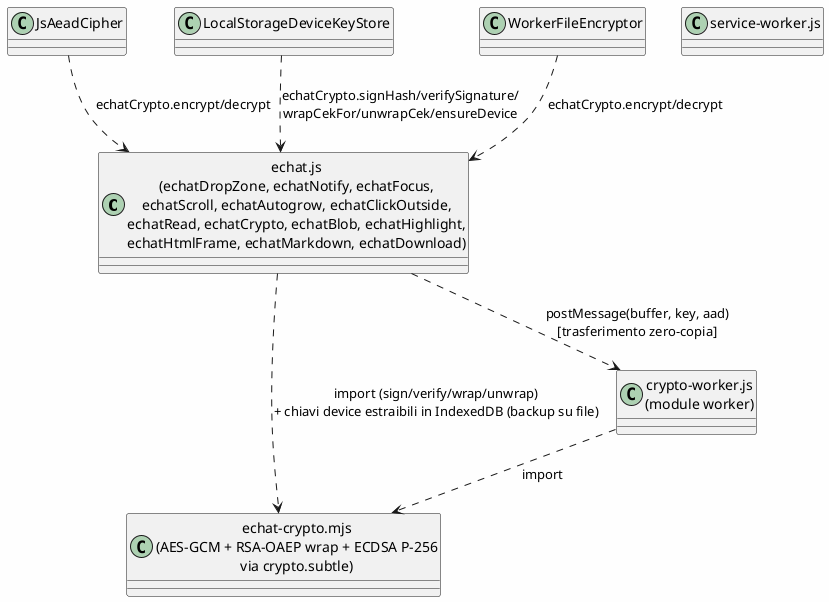

Tutto il JavaScript del client vive in `echat.js`. I tredici moduli esposti (`echatDropZone`, `echatNotify`, `echatFocus`, `echatScroll`, `echatAutogrow`, `echatClickOutside`, `echatRead`, `echatCrypto`, `echatBlob`, `echatHighlight`, `echatHtmlFrame`, `echatMarkdown`, `echatDownload`) coprono drag-and-drop, notifiche del browser, focus tracking, scrolling, auto-grow del compositore, chiusura su click esterno, marcatura di lettura, blob URL, evidenziazione del codice, rendering HTML in iframe, rendering Markdown, download e il bridge `echatCrypto` verso il crypto worker.

Tutta la crittografia del client è JavaScript, con **un'unica implementazione**: il modulo ES `echat-crypto.mjs` espone sopra WebCrypto le funzioni pure `encryptAesGcm`/`decryptAesGcm` (AES-256-GCM, wire `0xA1`), `wrapCek`/`unwrapCek` (RSA-OAEP-2048, wire `0xB2`), `signEcdsa`/`verifyEcdsa` (ECDSA P-256, IEEE-P1363) e la generazione delle coppie di chiavi del device. Lo importano sia il *module worker* `crypto-worker.js` (cifratura fuori dal main thread, `ArrayBuffer` in zero-copia) sia `echat.js`, che gestisce le coppie come `CryptoKey` **estraibili** in IndexedDB con export/import su file ([§6.1](#crittografia-e-sicurezza)). Le controparti C# non fanno crypto: instradano le chiamate via `IJSRuntime`. Poiché il modulo usa solo l'API WebCrypto standard, i test JS in `tests/js` ne esercitano *esattamente* il funzionamento.

### 2.5 Pattern utilizzati

I pattern utilizzati nel sistema sono organizzati nelle quattro categorie classiche. Per ciascun pattern si fornisce una definizione sintetica e l'elenco delle realizzazioni in ECHAT.

#### Pattern creazionali

**Factory Method**: un metodo specializzato decide quale classe concreta istanziare a fronte di una richiesta generica.
*Realizzazione*: `QuotaService.TryConsume(key)` istanzia pigramente un token bucket per ogni nuova chiave (`send`/`upload`/`download:{userId}`) e lo conserva in cache.

#### Pattern strutturali

**Adapter**: converte l'interfaccia di una classe in quella attesa dal chiamante, isolando il chiamante da una dipendenza tecnologica specifica.
*Realizzazioni*: `SignalRNotifier` → `IRealtimeNotifier` su SignalR; `BlobFileSystemStorage` → `IBlobStorageService` sul filesystem; i 3 adapter `LocalStorage*` (`LocalStorageOutboxStore`, `LocalStorageDeviceKeyStore`, `LocalStorageTransport`) → interfacce di persistenza locale su Web Storage.

**Bridge**: separa un'astrazione dalla sua implementazione, consentendo a entrambe di evolvere indipendentemente.
*Realizzazione*: `JsAeadCipher`/`JsSigner`/`WorkerFileEncryptor` (C#) sopra `echat-crypto.mjs` (JavaScript). L'astrazione *cifrare/firmare un buffer con una chiave* (`IAeadCipher`/`ISigner`) è disaccoppiata dall'implementazione WebCrypto in thread JS isolato tramite `IJSRuntime.InvokeAsync`.

**Decorator**: aggiunge comportamento a un oggetto avvolgendolo con un wrapper che ne condivide l'interfaccia.
*Realizzazione*: `CorrelationIdMiddleware` decora ogni richiesta ASP.NET Core aggiungendo `X-Correlation-Id` nella risposta e nello scope di logging.

**Facade**: espone un'interfaccia di alto livello unificata su un sottosistema complesso.
*Realizzazioni*: `IChatSdk` espone alla UI un'API minimale coordinando internamente i collaboratori del client; lato server `KeyAccessService` fa da facciata sulle CEK (serve i wrap depositati dai client e accetta i wrap in deposito) nascondendo `IKeyEnvelopeStore`. Il vecchio `ConversationKeyService`, che generava le CEK server-side, è stato rimosso nel redesign E2EE.

**Proxy**: un oggetto si sostituisce a un altro per controllarne l'accesso o fornire caching.
*Realizzazioni*: `AvatarController` è un caching proxy server-side verso le immagini profilo OAuth (cache 24 h + header `Cache-Control`); `SequenceLeaseManager` è un proxy client-side del `SequenceController` con cache locale degli intervalli di sequenza prenotati.

#### Pattern comportamentali

**Chain of Responsibility**: una richiesta attraversa una sequenza di handler, ciascuno dei quali può processarla o passarla al successivo.
*Realizzazioni*: `MessageIngestPipeline` con la catena `SenderIdentity → LeaseValidation → SignatureVerification → Deduplication → Persist → Notify → Audit` (ordine di registrazione in `Program.cs`, estendibile aggiungendo un `IIngestHandler`).

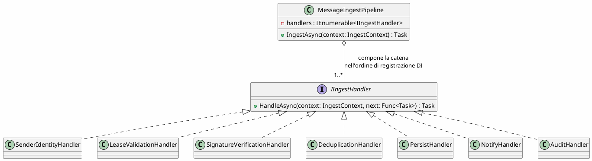

Il diagramma mostra la struttura del pattern nell'ingest dei messaggi: ogni handler riceve il contesto e il delegato `next`; può corto-circuitare la catena (rifiuto con eccezione di dominio, es. firma non valida in `SignatureVerificationHandler`) oppure invocare `next()` per passare al successivo. La pipeline non conosce gli handler concreti: l'ordine è interamente definito dalla registrazione DI, quindi un nuovo controllo (es. antivirus sugli allegati) si aggiunge implementando `IIngestHandler` senza toccare gli handler esistenti.

**Command**: incapsula una richiesta come oggetto, permettendo di parametrizzarla, accodarla, persistirla e ritentarla.
*Realizzazione*: `SendMessageCommand` come oggetto serializzabile, ritrasmettibile e persistibile in `LocalStorageOutboxStore` per ritentare l'invio dopo un crash o ricaricamento.

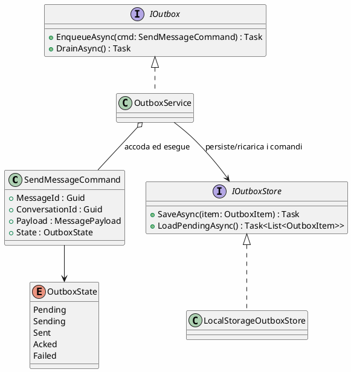

Qui il comando di invio è un oggetto autonomo che porta con sé tutto il necessario per essere eseguito (id, conversazione, payload) e il proprio stato di avanzamento (`OutboxState`, la macchina a stati di [§2.7.1](#271-stato-di-un-comando-della-coda-di-invio)). L'invocatore (`OutboxService`) non invia direttamente: accoda, persiste tramite `IOutboxStore` e ritenta al drain. È questa reificazione della richiesta che rende l'invio idempotente (il `MessageId` viaggia col comando) e resistente a crash e ricaricamenti della pagina.

**Iterator**: accesso sequenziale agli elementi di una collezione senza esporne la struttura interna.
*Realizzazione*: paginazione a cursore via `?afterSeq` / `?beforeSeq` sull'`IMessageRepository.QueryAsync`. La cronologia completa non viene mai materializzata, ogni richiesta restituisce la pagina successiva dal cursore.

**Mediator**: riduce l'accoppiamento facendo comunicare i componenti attraverso un coordinatore centrale.
*Realizzazioni*: `ChatHub` (lato server) instrada gli eventi di ingestion ai client connessi senza che mittenti e destinatari si conoscano; `MainLayout.razor` (lato client) riconcilia in un punto solo indicatore di non-letto, notifica acustica, notifica del browser e scorrimento automatico al cambiare della conversazione attiva o del focus.

**Memento**: cattura e ripristina lo stato interno di un oggetto senza violarne l'incapsulamento.
*Realizzazioni*: `Outbox` persiste ogni `SendMessageCommand` in Web Storage per sopravvivere al ricaricamento; `MigrationJobEntity` memorizza periodicamente checkpoint dello stato di avanzamento per permettere la ripresa dopo crash del server.

**Observer**: dipendenza uno-a-molti tra oggetti: al cambiamento di stato dell'emittente gli abbonati sono notificati automaticamente.
*Realizzazione*: `IRealtimeClient` espone gli eventi `OnMessageAvailable`, `OnEpochRotated` e `OnConnectionStateChanged` a cui UI e servizi (es. `AiAutoReplyService`) si abbonano.

**State**: un oggetto cambia comportamento al variare del proprio stato interno, attraverso transizioni esplicite tra stati nominati.
*Realizzazioni*: `OutboxState` (`Pending → Sending → Sent → Acked / Failed`); `MigrationJobEntity.Status` (`InProgress → Completed / Failed`). Entrambe le macchine sono diagrammate in [§2.7](#27-diagrammi-di-stato).

**Strategy**: famiglia di algoritmi intercambiabili tramite un'interfaccia comune.
*Realizzazione*: `IAeadCipher`, `ISigner`, `ICompressor` permettono di sostituire i singoli passaggi della pipeline crittografica; la sostituzione attiva è cipher/signer WebCrypto in produzione (`JsAeadCipher`/`JsSigner`) ↔ fake round-trip nei test C#.

**Template Method**: definisce lo scheletro di un algoritmo in un metodo, lasciando i passaggi variabili a implementazioni specializzate.
*Realizzazioni*: `ICryptoEngine.EncryptAsync` (serializzazione → compressione gzip → cifratura AEAD AES-GCM via il cipher iniettato) e `IChainValidator.ValidateAsync` (verifica seq → verifica `prevEnvelopeHash` → esito MAC AES-GCM → firma ECDSA del mittente → `ChainValidationResult`) hanno struttura fissa con step parametrizzabili via Strategy.

#### Pattern architetturali

**Model-View-Controller (MVC)**: separa logica applicativa, presentazione e coordinamento.
*Realizzazione*: controller ASP.NET nel `Server.App` (orchestrazione e binding, *nessuna* logica di business) e pagine Razor nel `Client.App`.

**Repository**: astrae l'accesso al data store dietro una collezione di oggetti.
*Realizzazione*: `IMessageRepository`, `IKeyEnvelopeStore`, `IBlobStorageService`, `IAuditLog` (e gli store di dominio) sono interfacce in `Server.Core`; le implementazioni concrete EF Core/filesystem stanno in `Server.App`.

**Saga**: workflow di lunga durata composto da più transazioni locali, con compensazione in caso di fallimento.
*Realizzazione*: `IMigrationOrchestrator` per la re-cifratura completa (`FullReencrypt`). Eseguibile al massimo una volta per conversazione, con finalizzazione in fase separata; sopravvive al crash del client custode perché il job persiste su DB con l'ultimo checkpoint memorizzato, e in caso di fallimento la compensazione è il `CancelAsync` (rollback dello stato job, nessun crypto-shred).

**Token Bucket**: rate limiting in cui ogni richiesta consuma un token da un bucket che si rifornisce a tasso costante.
*Realizzazione*: `QuotaService` limita send/upload/download per utente, rifiutando con `429` quando il bucket è esaurito; il client può ritentare con strategia di backoff.

### 2.6 Diagrammi di sequenza

#### 2.6.1 Invio di un messaggio

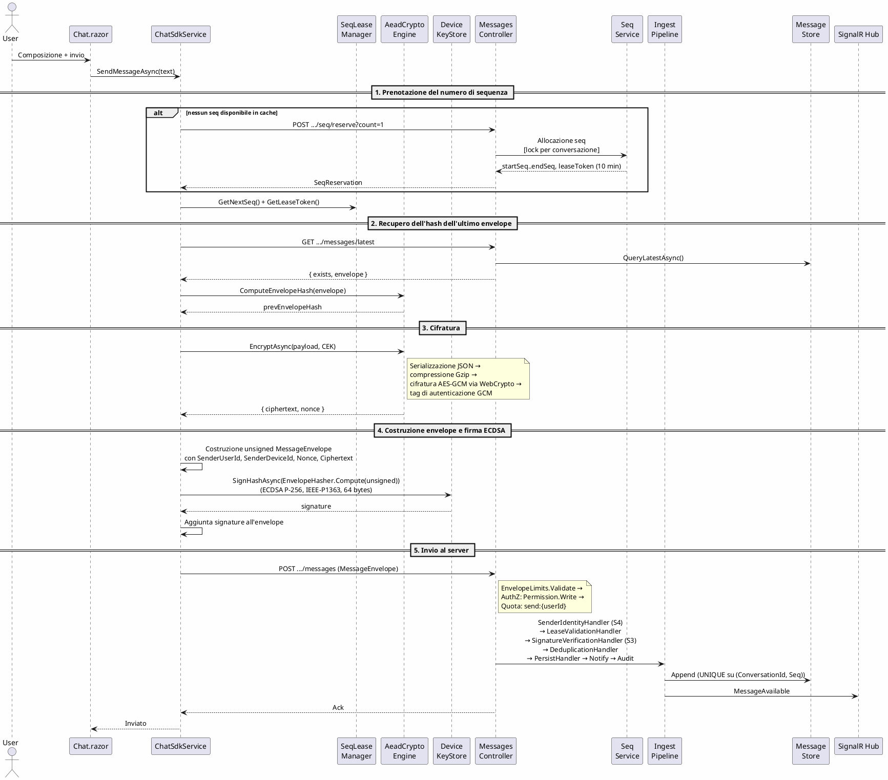

Il flusso si articola in quattro fasi. Il client prenota **un solo** numero di sequenza per messaggio (`count=1`, lease di 10 minuti): costo +1 HTTP, scelto deliberatamente perché i seq riflettano l'ordine cronologico effettivo degli invii (la pre-allocazione a batch, usata solo dal caricamento file, numerava le risposte AI prima del messaggio a cui rispondevano). Prima della cifratura il client calcola l'hash dell'ultimo envelope, che diventa il `prevEnvelopeHash` del nuovo payload (catena di integrità); l'AAD include `conversationId|messageId|seq|epochId`. Lato server il `MessagesController` valida dimensioni, permessi RBAC e quota *prima* della pipeline, che non decifra mai il ciphertext.

#### 2.6.2 Ricezione di un messaggio

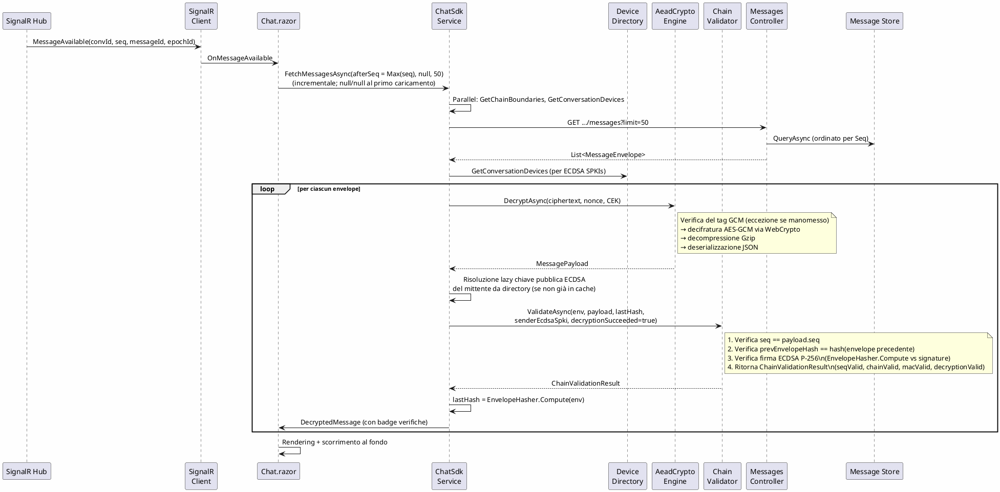

L'evento sul canale realtime è leggero: trasporta soltanto i metadati (`convId`, `seq`, `messageId`, `epochId`); il client non riceve il ciphertext via canale realtime ma esegue una richiesta HTTP separata. Questa architettura unifica la riconciliazione (recupero della cronologia dopo riconnessione) e la consegna realtime in un unico percorso. La verifica della [catena di hash](#crittografia-e-sicurezza) avviene in ordine di numero di sequenza: ogni envelope deve avere `prevEnvelopeHash == hash(envelope precedente)`. Una manomissione produce un risultato di validazione con `IsValid = false` e `Error = HashMismatch`.

#### 2.6.3 Caricamento di un file

Il flusso di caricamento riusa la struttura già diagrammata in [§2.6.1](#261-invio-di-un-messaggio), con tre differenze. *Envelope encryption per file*: ogni file possiede una propria DEK casuale da 32 byte; il corpo è cifrato AES-GCM nel Web Worker (fuori dal thread principale, magic `0xA1`) e la DEK è wrappata sotto la CEK di conversazione (magic `0xB2`). *Caricamento a parti*: il client apre una sessione (`POST .../files/begin` → `fileId` + `uploadToken`), carica blocchi da ≤ 2 MiB in parallelo a gruppi di quattro (`Task.WhenAll`) e finalizza; il server scrive le parti in una directory temporanea e la rinomina atomicamente solo quando tutte le parti sono presenti e verificate. *Aggancio alla chat*: a finalizzazione avvenuta il client invia un normale messaggio (`MessagePayload` con `AttachmentRef(fileId, wrappedDek)`) che segue per intero il flusso di §2.6.1.

#### 2.6.4 Aggiunta di un membro

L'aggiunta è un flusso a due fasi senza rotazione di epoca (l'evento `EpochRotated` è emesso solo alla rimozione). *Fase server*: `POST .../members` autorizza il chiamante (Owner o Admin), inserisce la membership con ruolo `Member` e notifica `MemberChanged(Added)`. *Fase client (E2EE, S1)*: il client dell'Admin consulta la device directory, recupera la CEK dell'epoca corrente dalla cache locale e la wrappa con la chiave pubblica RSA-OAEP di ogni device dei membri, incluso il nuovo, depositando i blob via `POST .../keys` (`CekProvisioner.GrantCurrentAsync()`; il server valida forma del blob 257 byte/`0xB2`, `KeyWrapVersion` e membership attiva del destinatario). Il flag `includeHistory` è propagato come richiesta di accesso alla cronologia, ma il provisioning delle CEK delle epoche precedenti non è ancora implementato.

#### 2.6.5 Revoca con sola rigenerazione delle chiavi (modalità RewrapOnly)

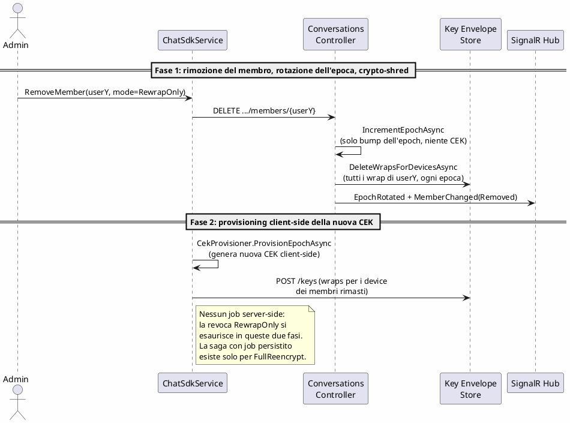

La modalità *RewrapOnly* è la modalità predefinita della procedura di revoca. È adeguata quando l'obiettivo è impedire al membro rimosso l'accesso alla cronologia conservata sul server, sotto l'assunzione che il membro non possieda copie locali del database. Il costo computazionale è minimo perché non viene re-cifrato alcun ciphertext: il server cancella in fase 1 le copie wrappate delle CEK destinate ai device del membro rimosso, mentre i membri rimasti conservano i propri wrap delle epoche precedenti e mantengono l'accesso alla cronologia. Il membro rimosso non riceve alcun wrap per la nuova epoca, quindi i messaggi futuri gli sono inaccessibili.

#### 2.6.6 Revoca con re-cifratura completa (modalità FullReencrypt)

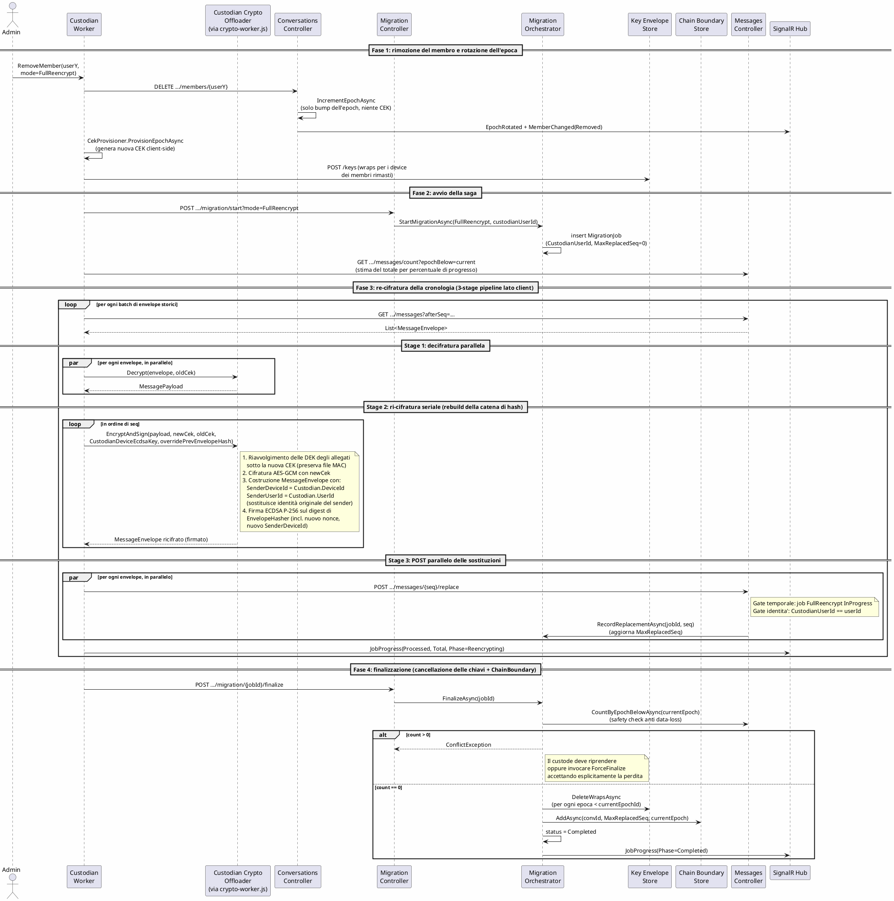

La modalità *FullReencrypt* esegue una re-cifratura completa della cronologia ed è adeguata quando l'obiettivo è proteggersi anche dal caso in cui il membro rimosso abbia ottenuto copie locali del ciphertext. Il lavoro pesante gira sulla postazione del Custodian come *pipeline a tre stage* per batch: decifratura fuori dal main thread (`crypto-worker.js`), ri-cifratura seriale per ricostruire la catena di hash via `OverridePrevEnvelopeHash` (con re-wrap delle DEK degli allegati sotto la nuova CEK), invio parallelo delle sostituzioni su `POST /messages/{seq}/replace`. Il server gate la chiamata su due assi: job `FullReencrypt` `InProgress` per la conversazione (gate temporale) e chiamante coincidente con il `CustodianUserId` registrato all'avvio (gate identità); ad ogni sostituzione aggiorna `MaxReplacedSeq`, che alimenta il `ChainBoundary` in fase 4.

La fase 4 di cancellazione delle chiavi è preceduta da un *pre-check di sicurezza*: il server conta gli envelope ancora all'epoch precedente (`CountByEpochBelowAsync`) e rifiuta il `FinalizeAsync` con `ConflictException` se il conteggio è positivo, perché il crypto-shred che segue renderebbe quegli envelope permanentemente illeggibili. In questo scenario il Custodian può riprendere la re-cifratura oppure invocare `POST .../migration/{jobId}/force-finalize`, che bypassa il pre-check accettando esplicitamente la perdita di accesso (audit `MigrationForceFinalized`, log con conteggio degli envelope persi).

In entrambe le modalità la cancellazione delle chiavi storiche, in fase 4, è ciò che effettivamente rende inaccessibile la cronologia: senza la chiave non esiste alcun modo di decifrare il ciphertext, anche se i byte cifrati restano nel Message Store.

### 2.7 Diagrammi di stato

#### 2.7.1 Stato di un comando della coda di invio

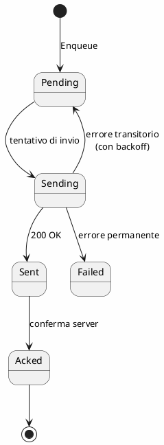

Lo stato `Failed` **non** è terminale: `OutboxService.GetPendingAsync` restituisce gli elementi sia in `Pending` sia in `Failed` per il rinvio, e `FailAsync` incrementa un `RetryCount` registrando il motivo dell'ultimo errore. Allo stato attuale il codice non implementa una strategia di backoff temporale né produce gli stati intermedi `Sending`/`Sent` (assegna solo `Pending`, `Acked` e `Failed`): il diagramma riflette il design previsto. La macchina sopravvive al ricaricamento della pagina perché lo stato è persistito in Web Storage tramite l'`IOutboxStore`.

#### 2.7.2 Stato di un job di migrazione

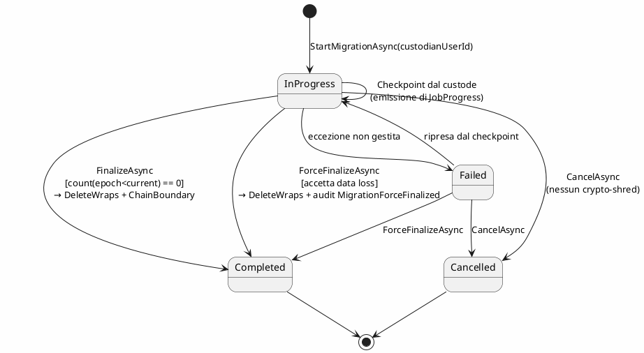

Il job nasce in stato `InProgress` con `CustodianUserId` registrato per l'esecuzione successiva dell'endpoint `POST /messages/{seq}/replace` e progredisce attraverso emissioni di `JobProgress` con avanzamento del `MaxReplacedSeq`. Le transizioni terminali sono tre: `Completed` (dal `FinalizeAsync` standard se il pre-check `CountByEpochBelow` ritorna 0, oppure dal `ForceFinalizeAsync` con perdita esplicitamente accettata), `Cancelled` (idempotente, *non* esegue il crypto-shred) e `Failed`. Il campo `Status` ha `[ConcurrencyCheck]`: due transizioni concorrenti contraddittorie (un checkpoint in ritardo dopo una `CancelAsync`) sollevano `ConcurrencyConflictException` e il wrapper `TrySaveAsync` interpreta la collisione come idempotenza.

#### 2.7.3 Stati semplici: lease di sequenza ed epoca crittografica

Il *lease di sequenza* nasce `Active` all'emissione (`ReserveRangeAsync`), scade al TTL di 10 minuti ed è cancellato dallo sweep di retention; un lease scaduto non è più valido e i seq non utilizzati lasciano un buco nella catena, che il Custodian chiude generando envelope `GapTombstone` (F3.2). L'*epoca crittografica* è un intero monotono per conversazione: si incrementa a ogni rimozione di membro e non viene mai decrementata né riusata che semplifica la gestione delle chiavi storiche in `IKeyEnvelopeStore`.

### 2.8 Diagramma di attività: flusso di revoca dei diritti di accesso

I diagrammi di sequenza in [§2.6.5](#265-revoca-con-sola-rigenerazione-delle-chiavi-modalità-rewraponly) e [§2.6.6](#266-revoca-con-re-cifratura-completa-modalità-fullreencrypt) mostrano lo scambio di messaggi tra i partecipanti del flusso di revoca. Il diagramma di attività seguente complementa quella vista mostrando lo stesso processo in termini di *responsabilità degli attori*, evidenziando i punti di decisione, le elaborazioni parallele e la condizione di sincronizzazione tra cliente, server e servizio di background.

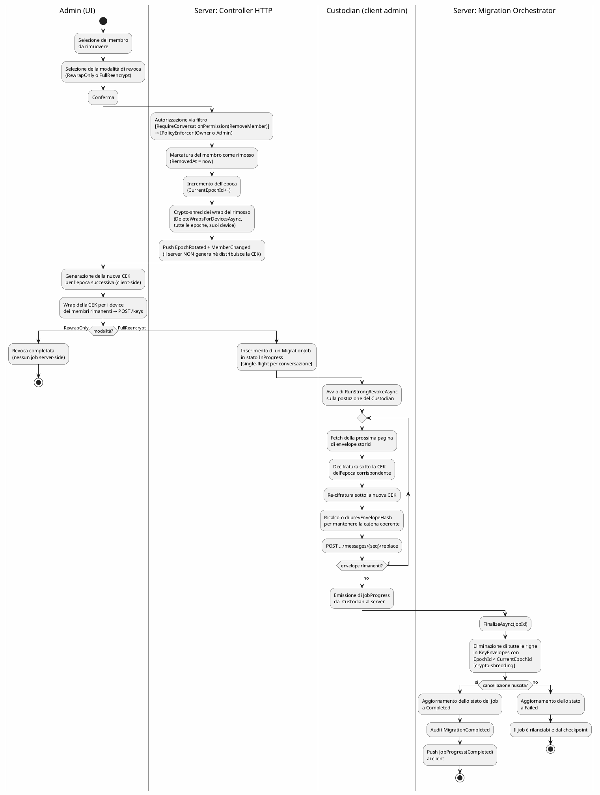

Il diagramma rende esplicito un punto che dai sequence diagram non emerge immediatamente: in modalità `RewrapOnly` non esiste alcun job server-side: la revoca si esaurisce nella rimozione (epoch bump + crypto-shred dei wrap del rimosso) e nel provisioning client-side della nuova CEK. In modalità `FullReencrypt` il lavoro pesante si svolge sul client del Custodian, in un ciclo per pagine di envelope, con il server che si limita ad accettare le repliche tramite l'endpoint amministrativo `POST .../messages/{seq}/replace`. Il punto di sincronizzazione finale è uno solo, l'invocazione di `FinalizeAsync`, al di sotto del quale tutta la cancellazione delle chiavi storiche avviene in modo transazionale a livello di base di dati.

### 2.9 Concorrenza e sincronizzazione

I blob committati sono *immutabili* per costruzione, e per questa ragione non richiedono alcun meccanismo di lock dopo il commit. I lock vengono utilizzati esclusivamente sulle risorse mutabili (ancora della catena di hash, membership, caricamento di file in corso) e sui punti di coordinamento (prenotazione di numeri di sequenza, job di migrazione).

| Risorsa | Granularità | Tipo |
|---|---|---|
| Prenotazione di numeri di sequenza (server) | per conversazione | `SemaphoreSlim` statico in-process attorno a `ReserveRangeAsync` (lettura `NextSeq` → incremento → save); per multi-instance servirebbe un lock distribuito (Redis, advisory locks MySQL, o `UPDATE ... FOR UPDATE`) |
| Invio messaggio per conversazione (client) | per conversazione | `ConcurrentDictionary<Guid, SemaphoreSlim> _sendLocks` in `MessageFlowOrchestrator.SendMessageAsync`: serializza gli invii dallo stesso client per evitare riservazioni concorrenti; gli upload di file pre-riservano in batch via `PreReserveSeqsAsync(count)` |
| Append sul Message Store | per conversazione | Lock implicito di base di dati + vincolo `UNIQUE(ConversationId, Seq)` |
| Finalizzazione del caricamento di un file | per fileId | Stato + rinominazione atomica (temp → finale) |
| Modifica della membership e dell'epoca | per conversazione | Lock serializzante |
| Job di migrazione: stato | per job | `[ConcurrencyCheck]` su `MigrationJobs.Status` + `TrySaveAsync` (mappa `DbUpdateConcurrencyException` → `ConcurrencyConflictException`, interpretato come idempotenza) |
| Job di migrazione: single-flight | per conversazione | Verifica `HasActiveJobAsync` + `ConflictException` in `StartMigrationAsync` |
| Quota di tasso | per (azione, userId) | Token bucket in memoria |
| Caricamento parallelo di parti di file | globale per file | `Task.WhenAll` di quattro parti per blocco |

### 2.10 Trasporto e sicurezza in transito

Il canale primario è HTTP/2 affiancato da WebSocket per il canale realtime (SignalR), uno standard compatibile con l'infrastruttura tipica di un'organizzazione (proxy, firewall, CDN). La sicurezza in transito poggia su TLS 1.3 con HSTS in produzione, una Content-Security-Policy restrittiva, l'header `X-Frame-Options: DENY`, una `Permissions-Policy` restrittiva, e una whitelist di origini configurata tramite `Cors:AllowedOrigins`. L'autenticazione utente avviene tramite Google OAuth per il login e JWT Bearer per le API. **Nota sulla verifica server-side**: il server non decifra mai il `Ciphertext` dei messaggi, ma esegue una verifica della firma ECDSA P-256 (S3, `SignatureVerificationHandler`) sul digest di `EnvelopeHasher` contro la chiave pubblica del device mittente (dalla `DevicePublicKeys` directory), _prima_ della persistenza. Questo rifiuta gli envelope forgiati senza richiedere la decifratura.

Sul versante della procedura amministrativa di re-cifratura sono implementate due salvaguardie esplicite. La prima è il *gate identità + temporale* su `POST /api/conversations/{id}/messages/{seq}/replace`: l'endpoint richiede sia un permesso di livello `Admin` sulla conversazione, sia un job `FullReencrypt` `InProgress` per quella conversazione, sia che il chiamante coincida con il `CustodianUserId` registrato all'avvio del job. Senza il triplo controllo un admin con un JWT valido potrebbe riscrivere silenziosamente la storia anche fuori da una migrazione legittima. La seconda è il *safety check anti data-loss* su `FinalizeAsync` per la modalità `FullReencrypt`: il pre-check `CountByEpochBelowAsync` rifiuta la finalizzazione con `409 Conflict` se restano envelope all'epoch precedente, perché il crypto-shred successivo li renderebbe permanentemente illeggibili. La perdita è ammissibile solo tramite il percorso esplicito `ForceFinalize`, che produce sia un log `WARNING` con il conteggio sia un audit `MigrationForceFinalized`. Parallelamente, il `POST /messages` standard è rifiutato con `409 Conflict` se per la conversazione esiste un job `FullReencrypt` attivo, per evitare che nuovi envelope all'epoch corrente entrino in mezzo alle sostituzioni del custode.

### 2.11 Interfacce operative

Le seguenti interfacce non sono utilizzate dall'utente finale ma dall'orchestratore di deployment e dagli operatori del sistema.

**Endpoint di verifica dello stato di servizio.** Il server espone due endpoint HTTP non autenticati: `/health` per il controllo di prontezza al servizio (include la verifica della connettività a EF Core e quindi alla base di dati MySQL) e `/health/live` per il solo controllo di vitalità. Il primo è utilizzato dall'orchestratore di deployment per disabilitare automaticamente le istanze non sane; il secondo è utilizzato per riavviare istanze in deadlock.

**Servizi in background.** Il servizio `BackgroundService` ASP.NET Core `RetentionBackgroundService` esegue lavoro asincrono fuori dal thread di richiesta: periodicamente purga i lease scaduti e le voci di audit oltre la finestra di retention configurabile (predefinito: 90 giorni); l'intervallo dello sweep è configurabile. La saga `FullReencrypt` non richiede un worker server-side: il lavoro pesante gira sul client del Custodian e il server si limita a persistere checkpoint e stato del job.

**Identificatore di correlazione.** Il `CorrelationIdMiddleware` aggiunge a ogni richiesta un identificatore univoco (`X-Correlation-Id`) che si propaga in tutti i log emessi durante il processamento e nell'header di risposta, permettendo all'operatore di tracciare un'intera esecuzione cross-componente.

### 2.12 Catalogo delle API REST

Le interfacce HTTP esposte dal `Server.App` sono riassunte in un unico catalogo. La colonna *Permesso* indica il gate applicato in modo dichiarativo dai filtri `[RequireConversationPermission(Permission)]` / `[RequirePlatformAdmin]` (delega a `IPolicyEnforcer`, `403` prima dell'esecuzione dell'action); «auth» indica il solo `[Authorize]` JWT, «membro» la membership attiva. Il contratto completo di richieste e risposte è nella specifica OpenAPI generata da `Microsoft.AspNetCore.OpenApi` (`/openapi/v1.json`, UI interattiva `/scalar/v1`).

| Metodo e path (`/api/...`) | Permesso | Funzione |
|---|---|---|
| GET `auth/google-login`, GET `auth/google-signed-in` | anonimo | Flusso OAuth: avvio e callback (emette il JWT Bearer). |
| GET `auth/me` | auth | Dati dell'utente autenticato. |
| GET/POST `conversations` | auth | Lista delle proprie conversazioni; creazione (il creatore diventa Owner). |
| GET `conversations/{id}`, GET `.../members` | membro | Dettaglio conversazione e lista membri. |
| POST `.../members` | `AddMember` | Aggiunge un membro (opzione `includeHistory`). |
| DELETE `.../members/{userId}` | `RemoveMember` | Rimuove il membro, ruota l'epoca e crypto-shredda i suoi wrap; risponde `{ newEpochId }`. |
| POST `.../members/{userId}/role` | `ManageRoles` | Cambia ruolo (Admin/Moderator/Member). |
| POST `.../transfer-ownership` | Owner | Trasferisce la proprietà. |
| PUT `conversations/{id}` / DELETE `conversations/{id}` | `Admin` / `DeleteConversation` | Rinomina / cancella definitivamente (crypto-shred totale). |
| POST `.../messages` | `Write` | Append di un envelope cifrato via pipeline di ingest; `409` se è attivo un job `FullReencrypt`. |
| GET `.../messages`, GET `.../messages/latest` | `Read` | Paginazione a cursore (`afterSeq`/`beforeSeq`/`limit`); ultimo envelope per `prevEnvelopeHash`. |
| GET `.../messages/count?epochBelow=N` | `Read` | Conta gli envelope a epoca < N (stima del Custodian). |
| GET `.../messages/chain-boundaries` | `Read` | Lista dei `ChainBoundary` (ripartenze legittime della catena). |
| POST `.../messages/{seq}/replace` | `Admin` + identità custode | Sostituzione di un envelope storico durante la re-cifratura (triplo gate: permesso, job attivo, `CustodianUserId`). |
| POST `.../messages/{seq}/moderate` | `ModerateMessages` | Nasconde/ri-mostra un messaggio (flag reversibile, ciphertext intatto, regola di gerarchia, audit + evento realtime). |
| POST `.../seq/reserve` | membro | Prenota un intervallo di sequenza con lease token (TTL 10 min). |
| GET `.../keys?epochId=&deviceId=` | `Read` | Restituisce i propri `WrappedCek` (ogni device accede solo ai propri wrap). |
| POST `.../keys` | `AddMember` | Deposita i wrap CEK prodotti dal client (validazione: membro attivo, blob 257 byte `0xB2`, `KeyWrapVersion == 1`). |
| POST `.../tombstones` | `Admin` | Inserisce envelope `GapTombstone` per chiudere i buchi di sequenza. |
| POST `devices/register`, GET `devices/me` | auth | Enrollment delle chiavi pubbliche del device (S1-S4) e lista dei propri device. |
| GET `.../devices`, GET `.../devices/{deviceId}` | `Read` | Device pubblici dei membri attivi (per il wrap); chiave di un device storico mittente (per verificare firme di rimossi). |
| POST `.../files/begin`, PUT `.../parts/{n}`, POST `.../finalize` | `Upload` | Sessione di caricamento a parti (≤ 2 MiB) con finalizzazione atomica. |
| GET `.../files/{fileId}` | `Download` | Scarica il ciphertext completo del file. |
| POST `.../migration/start?mode=FullReencrypt` | `Admin` | Avvia la saga di re-cifratura (unica modalità con job server-side: `RewrapOnly` → `400`, si esaurisce in RemoveMember); registra il `CustodianUserId`. |
| POST `.../migration/{jobId}/checkpoint` · `finalize` · `force-finalize` · `cancel` | `Admin` | Avanzamento del job; finalize con pre-check anti data-loss (`409` se restano envelope vecchi) + scrittura `ChainBoundary`; force-finalize bypassa il pre-check (audit + `WARNING`); cancel idempotente senza shred. |
| GET `admin/stats` · `users` · `users/{id}` · `audit?...` | PlatformAdmin | Statistiche, anagrafica utenti, query paginata del log di audit (filtri opzionali, `limit` clampato a 500). |
| POST `admin/users/{id}/role` · `activate` · `deactivate` | PlatformAdmin | Gestione di ruolo di piattaforma e stato attivo. |
| GET `avatar/{userId}` | anonimo | Proxy con cache (24 h) delle immagini profilo OAuth (anonimo per necessità: `` non trasporta il bearer; GUID opaco). |
| POST `ai/reply`, GET `users/search?q=` | auth | Proxy verso il modello generativo (risposta automatica); ricerca utenti per nome/email. |

### 2.13 Integrazioni con sistemi esterni

Le dipendenze esterne al perimetro di sviluppo del sistema si dividono in *servizi remoti* consumati via HTTPS e *librerie* integrate a livello applicativo. Sono tutte opzionali: la disabilitazione degrada in modo controllato una funzionalità specifica senza compromettere la disponibilità del sistema nel suo complesso.

| Componente | Ruolo | Sostituibilità |
|---|---|---|
| **Google OAuth** | Provider di identità: dal token OIDC il server estrae `sub`/`email`/`name`/`picture`, crea/aggiorna `Users` ed emette il JWT applicativo. | Qualsiasi provider OIDC (handler `OpenIdConnect`); il Core non cambia. |
| **OpenAI** | Modello generativo per la risposta automatica, dietro proxy server-side (`AiController`): la chiave API non lascia il server. | API compatibile (Anthropic, Mistral, self-hosted); senza chiave la funzione si disabilita. |
| **Pomelo + EF Core** | Provider EF Core per MySQL (EF 9 su runtime .NET 11). | Altro DB relazionale cambiando provider e rigenerando le migration; il Core non importa EF. |
| **WebCrypto (`crypto.subtle`)** | Tutta la crittografia del client, fuori dal main thread via `crypto-worker.js` (dettagli in [§2.4.11](#2411-echatclientapp--integrazione-javascript-e-web-worker)). | API standard, identica in Node 20+: i test JS eseguono lo stesso codice di produzione. |
| **SignalR** | Canale realtime WebSocket (eventi tipizzati, fallback long-polling). | Dietro l'astrazione `IRealtimeNotifier`/`IRealtimeClient` già presente. |
| **Docusaurus + PlantUML + Puppeteer** | Solo per la documentazione: sito, diagrammi e generazione del PDF (`npm run pdf` in `docs-site`). | Fuori dal runtime del prodotto. |

---

## 3. Piano di test

### 3.1 Verifica e validazione

Si distinguono *verifica* (il prodotto è costruito correttamente rispetto alla specifica) e *validazione* (il prodotto risponde ai requisiti utente). La verifica è coperta dai test di unità sui moduli `*.Core` e dai test di integrazione sui flussi cross-componente, con l'analisi statica del compilatore C# (nullable, warning-as-error). La validazione avviene con test manuali sull'interfaccia e con il riscontro periodico dei requisiti di [§1.4](#14-requisiti-funzionali) e [§1.5](#15-requisiti-non-funzionali).

### 3.2 Strategia di test

I test seguono tre approcci complementari.

**Test funzionali black-box.** Si verifica il comportamento osservabile del componente, senza fare riferimento all'implementazione. Esempio in ECHAT: la coda di invio (`Outbox`) deve transire `Pending → Sending → Sent → Acked`; un client che invia due volte lo stesso `messageId` deve produrre un'unica scrittura sul server (idempotenza); l'invocazione di `Encrypt(payload, cek)` seguita da `Decrypt` sul ciphertext risultante deve riprodurre fedelmente il `payload` originale.

**Test strutturali (white-box).** Si scrivono test mirati a coprire i rami condizionali e i casi limite dell'implementazione. Esempio: il metodo `EnvelopeLimits.Validate` rifiuta ciphertext oltre 1 MiB, nonce oltre 64 byte, signature oltre 256 byte, lease token oltre 128 caratteri, valori di `seq` o `epoch` non positivi. Per ciascun vincolo esistono due test: uno per il caso negativo (input invalido) e uno per il caso positivo al confine. Sui moduli con logica condizionale critica (validatore di catena, ciclo di vita del lease, transizioni di stato) la copertura di rami è la soglia minima perseguita.

**Test di integrazione.** Si esercitano più componenti reali in cooperazione, sostituendo soltanto le risorse esterne (base di dati, filesystem) con doppi in-memory equivalenti. Esempio: il `MigrationOrchestratorService` end-to-end con il provider EF Core InMemory (avvio della migrazione → emissione di eventi di avanzamento → finalizzazione → verifica che le chiavi delle epoche precedenti a quella corrente siano state cancellate).

### 3.3 Test di unità

I test di unità sono *obbligatori* per il progetto e vivono in due assembly distinti, uno per ciascun lato del sistema, ciascuno specchio del rispettivo `*.Core`.

L'assembly `ECHAT.Client.Core.Tests` (**206 test**) copre la logica del client: il motore crittografico composito (`AeadCryptoEngine`: serializzazione → gzip → cipher, con fake round-trip al posto di WebCrypto), l'orchestratore del flusso messaggi (cache CEK per epoca, build + firma ECDSA dell'envelope, riuso del lease, catena di hash, fetch + decifratura + verifica firma con gestione dei fallimenti), il provisioning delle CEK (`CekProvisioner`), l'enrollment del device, il custode (`CustodianWorker`: saga di revoca, tombstone, cancellazione), l'orchestratore dei file cifrati, la coda di invio (`OutboxService`: macchina a stati, ritentativi, persistenza), il validatore di catena (`ChainValidator`: seq/hash, verifica reale della firma ECDSA, esiti negativi) e i componenti accessori (lease manager, `FileCipher`, `EnvelopeHasher`, renderer Markdown, composer AI). La correttezza dei primitivi reali (AES-GCM, RSA-OAEP, ECDSA P-256) è verificata dai 16 test JS in `tests/js`, che eseguono su Node *esattamente* il modulo di produzione `echat-crypto.mjs`.

L'assembly `ECHAT.Server.Core.Tests` (**238 test**) copre la logica del server: i sette handler della pipeline di ingest (identità del mittente S4, validazione del lease, firma ECDSA S3, deduplicazione, persist, notify e audit con i rami fire-and-forget), la matrice completa di `PolicyEnforcer` (ruoli × permessi, incluse le riserve dell'Owner e il ruolo di piattaforma), `QuotaService` (token bucket), la saga di migrazione (`MigrationOrchestratorService`: single-flight, rifiuto di `RewrapOnly` allo start, guardia IDOR, finalize/force-finalize con crypto-shred) e i servizi estratti dai controller (`EnvelopeValidator`, `SeqCounterDomainService`, `KeyAccessService`, `DeviceDirectoryService`, `MessageModerationService` con la regola di gerarchia, `EcdsaInteropTests` con vettori di firma cross-language, JWT, tombstone, ricerca utenti, AI, avatar).

In entrambi gli assembly gli strumenti sono xUnit (runner), Moq (doppi delle dipendenze) e FluentAssertions (asserzioni dichiarative); `Client.Core.Tests` aggiunge undici fake in-memory che permettono di testare gli orchestratori senza HTTP né Blazor, con round-trip deterministico al posto di WebCrypto.

### 3.4 Test di integrazione

I test di integrazione (opzionali per il progetto, ma realizzati) vivono nell'assembly `ECHAT.Integration.Tests` e raccolgono **129 test**. Esercitano i servizi di Core sopra gli store EF reali: le operazioni di conversazione (creazione completa di counter e audit, add/remove member con rotazione di epoca e crypto-shred dei wrap del rimosso, transfer ownership, regole di business come «l'Owner non è rimovibile nemmeno da un Admin»), l'accesso alle chiavi (`KeyAccessService`), le statistiche di piattaforma con la query paginata dell'audit, la saga di migrazione end-to-end (avvio `FullReencrypt`, rifiuto di `RewrapOnly`, cancel, force-finalize con perdita, idempotenza sugli stati terminali), il servizio di sequenza (TTL del lease, serializzazione concorrente per conversazione), i filtri di autorizzazione (`ConversationPermissionFilterTests`: short-circuit `401`/`403` prima dell'action) e la suite `FullReencryptIntegrationTests`, che percorre l'intera pipeline a tre stage del Custodian (decifratura → ri-cifratura → `/replace`) con pre-check anti data-loss, scrittura del `ChainBoundary` e gate d'identità. Vi si aggiunge la suite **E2E HTTP** `SecurityBoundaryTests` su `WebApplicationFactory`, che attraversa endpoint reali + filtri + pipeline asserendo S3/S4 al confine HTTP (firma forgiata → 403, `SenderUserId` ≠ JWT → 403, device non registrato → 403, mappatura di `CoreExceptionFilter`).

Lo strumento aggiuntivo rispetto ai test di unità è il provider `Microsoft.EntityFrameworkCore.InMemory`, che sostituisce nei test la base di dati MySQL con un provider in-memory funzionalmente equivalente.

### 3.5 Aree non coperte da test automatici

L'interfaccia Blazor del client (`Client.App`) non è coperta da test di unità (ed è esclusa dall'ambito della misura di copertura tramite `coverage.runsettings`) e la sua validazione avviene tramite test manuali nel browser. Le motivazioni sono due. La prima è tecnica: la libreria bUnit ha ancora supporto parziale per la versione corrente di Blazor su .NET 11. La seconda è progettuale: tutta la logica di flusso messaggi, crittografia, orchestrazione saga e composizione prompt AI è stata spostata in `Client.Core` (coperto al 97.1% di linee, vedi [§4](#4-rapporto-sulla-copertura-dei-test)) e lì è esercitata dai test di unità; ciò che resta nell'`App` è codice di adattamento (HTTP gateway, JS interop crypto `JsAeadCipher`/`JsSigner`, SignalR client, localStorage, `MigrationStateTracker`) la cui correttezza si verifica meglio manualmente nel browser, fatta eccezione per la crittografia JS, ora coperta dai test Node in `tests/js`.

Anche l'assembly `Server.App` è **escluso dall'ambito della misura di copertura** (`coverage.runsettings`) per scelta progettuale: contiene principalmente controller sottili, hub, hosted service e middleware ASP.NET (più codice generato e migration EF), la cui correttezza dipende dal framework più che dal nostro codice. È comunque esercitato a livello di sistema dai test di integrazione (che attraversano i servizi di Core delegati e gli adapter EF) e dalla suite E2E HTTP `SecurityBoundaryTests` su `WebApplicationFactory`. La logica di business è invece in Core ed è coperta al 97.9% (Server.Core).

La crittografia JavaScript (`echat-crypto.mjs`, vedi [§2.4.11](#2411-echatclientapp--integrazione-javascript-e-web-worker)) è testata direttamente dai 16 test in `tests/js/crypto.test.mjs` (runner integrato di Node, nessuna dipendenza npm), che coprono round-trip AES-GCM con manomissione e AAD errata, wrap/unwrap RSA-OAEP della CEK, firma/verifica ECDSA P-256 e backup/restore su file delle chiavi; i vettori di firma cross-language sono nei test C# `EcdsaInteropTests`. I test del `Client.Core` usano fake round-trip per i primitivi, verificando il *flusso* anziché il cifrario.

I test di carico e di prestazione non sono eseguiti in modo automatizzato e sono dichiarati fuori perimetro per la versione corrente.

### 3.6 Test di sistema manuali

I test di sistema, eseguiti manualmente prima di ogni rilascio significativo, esercitano l'intero stack (browser, server, MySQL, SignalR) con due o più postazioni client autenticate da identità Google reali, validando ciò che unità e integrazione non vedono: responsività, consegna realtime tra browser, decifratura nel Web Worker, transizioni di stato del browser (focus, riconnessione, ricaricamento). I risultati osservati corrispondono agli esiti attesi e sono visibili nelle [anteprime dell'interfaccia](#anteprime-dellinterfaccia).

| ID | Scenario | Esito atteso |
|---|---|---|
| **TS1** | Sessione completa: autenticazione Google OAuth dell'utente A, creazione di una conversazione di gruppo, aggiunta dell'utente B, scambio di sei messaggi alternati in formato `Plain` e `Markdown`. | A diventa Owner; B riceve `MemberChanged` realtime; ogni messaggio recapitato entro la soglia di percezione; sotto ogni messaggio i quattro badge `Decrypt`, `MAC`, `Seq`, `Chain` sono `OK`. |
| **TS2** | Composizione multi-formato: A invia un messaggio in `Markdown` con sintassi avanzata (titolo, grassetto, blocco di codice, link); poi un messaggio in `Html` contenente un tentativo di `<script>` malizioso. | Markdown renderizzato correttamente. Lo script HTML non viene eseguito perché il rendering è in iframe in sandbox; sotto al frame compare «Sandboxed iframe, scripts blocked». |
| **TS3** | Allegato cifrato end-to-end: A trascina un file CSV nell'area chat; B clicca sull'anteprima ricevuta. | Il file è cifrato lato client (verificabile via DevTools: `PUT` con payload binario in parti da 2 MiB); B riceve un messaggio `FileRef` con anteprima in linea della tabella CSV e badge di verifica `OK`; il server non vede mai byte in chiaro. |
| **TS4** | Resilienza della coda di invio: A compone un messaggio con rete disabilitata; il messaggio entra in coda locale `Pending`; si ricarica la pagina; si riabilita la rete. | Dopo il ricaricamento il messaggio è ancora `Pending`; al ripristino della rete il messaggio viene recapitato esattamente una volta (idempotenza per `messageId`) e transita ad `Acked`. |
| **TS5** | Notifiche e tracciamento del focus: A invia un messaggio in una conversazione che B non ha aperta, con varianti finestra-con-focus / finestra-senza-focus / conversazione-aperta. | Il contatore non-letto di B si incrementa; suono di notifica; notifica desktop solo a finestra senza focus. All'apertura della conversazione il contatore si azzera; nuovi messaggi su conversazione aperta + finestra con focus sono marcati letti all'arrivo. |
| **TS6** | Membership e revoca dei diritti di accesso: A (Owner) rimuove B (la rimozione standard ruota l'epoca e crypto-shredda i wrap di B; la variante `FullReencrypt` ri-cifra anche la cronologia). | Rimozione standard: i membri rimanenti ricevono `EpochRotated`; i messaggi successivi viaggiano sotto la nuova CEK; B riceve `403` sulla `GET /messages`; i wrap di B sono cancellati per tutte le epoche (la cronologia è inaccessibile a B anche con una copia del database del server), mentre la cronologia in cache locale di B resta accessibile. Variante `FullReencrypt`: in aggiunta, ogni envelope storico è ri-cifrato sotto la nuova CEK e le CEK delle epoche precedenti sono cancellate per tutti. |
| **TS7** | Risposta automatica opzionale: A attiva la funzione e invia un messaggio. | Dopo 1–4 secondi appare in conversazione una risposta generata dal modello esterno tramite il proxy `POST /api/ai/reply`, con badge di verifica positivi. |

---

## 4. Rapporto sulla copertura dei test

I dati riportati in questa sezione sono stati ottenuti con il comando `dotnet test --settings coverage.runsettings --collect:"XPlat Code Coverage"`, con output in formato copertura prodotto da `coverlet`. L'aggregazione dei report multi-assembly è fatta con `dotnet-reportgenerator-globaltool` e il riepilogo è committato (path tracciato, non ignorato) in `docs-site/test-coverage/Summary.txt`.

### 4.1 Riepilogo dei conteggi

Convenzione di conteggio: il numero è il totale dei **casi eseguiti** riportati da `dotnet test` (un `[Theory]` con più `[InlineData]` conta come N casi, il che è significativo per le matrici parametrizzate come `PolicyEnforcerTests`, 13 invocazioni sulla matrice ruoli × azioni, ed `EnvelopeLimitsTests`).

| Progetto | Test (casi eseguiti) | Esito |
|---|---|---|
| `ECHAT.Client.Core.Tests` | **206** | Superati |
| `ECHAT.Server.Core.Tests` | **238** | Superati |
| `ECHAT.Integration.Tests` | **129** | Superati |
| `tests/js` (Node, WebCrypto) | **16** | Superati |
| **Totale** | **589** | **Superati** |

I file di test sono specchio dei rispettivi servizi; le suite più pesate riflettono i punti più critici del sistema: lato client il tracker di stato della migrazione (`MigrationStateManagerTests`, 18) e l'orchestratore del flusso messaggi (13); lato server la matrice dei permessi (`PolicyEnforcerTests`, 17) e il validatore degli envelope (11); lato integrazione le operazioni di conversazione (14), la statistica di piattaforma (15) e la saga di migrazione (11). Il rafforzamento della suite è stato guidato dall'analisi manuale dei percorsi critici (validazione anti-replay del lease, guardie fail-closed di firma e verifica, percorso device del key-access, rami fire-and-forget di notify/audit), ciascuno coperto con test mirati.

### 4.2 Copertura aggregata per assembly

I numeri seguenti sono **misurati** (09/06/2026) eseguendo `dotnet test --settings coverage.runsettings --collect:"XPlat Code Coverage"` e unendo i report copertura con `reportgenerator`. **Ambito della misura**: la copertura è calcolata sulla *logica di business* (i progetti `*.Core` e `ECHAT.Models`), mentre gli strati `*.App` sono **esclusi per scelta progettuale** dal file `coverage.runsettings` (vedi sotto). I primitivi crittografici reali (AES-GCM, RSA-OAEP, ECDSA) girano su WebCrypto e sono coperti a parte dai test JS in `tests/js` (vedi §3.5/§4.1): nei test C# i corrispondenti adapter sono sostituiti da fake, quindi la loro copertura non compare qui.

| Assembly (ambito unit test) | Copertura linee |
|---|---|
| `ECHAT.Server.Core` | **97.9%** |
| `ECHAT.Client.Core` | **97.1%** |
| `ECHAT.Models` | **85.9%** |
| **Aggregato (Core + Models)** | **97.0%** (2682 / 2764 linee); rami 91.3% (720 / 788), metodi 91.4% (472 / 516) |

L'aggregato del **97% di linee** (e oltre il **91% di rami**) si riferisce al codice oggetto di test di unità, ossia la logica di business del sistema. In `Server.Core` l'intera pipeline di ingest è al 100% sui singoli handler (identità del mittente, firma, lease) accanto a policy enforcer, key access e device directory; in `Client.Core` i servizi del redesign E2EE (`CekProvisioner`, `ChainValidator`, `DeviceEnrollmentService`, `FileEncryptionOrchestrator`) sono al 100% e il margine residuo è quasi solo nei percorsi d'errore difensivi non riproducibili dall'esterno. `ECHAT.Models` è all'85.9%: i tipi del protocollo sono al 100%, restano a 0% alcuni DTO di sola risposta HTTP esercitati solo dallo strato App/browser.

Gli strati **`*.App` sono fuori dall'ambito della percentuale** perché sono quasi interamente thin orchestration/UI (vedi §3.5), ma non sono lasciati senza verifica: la suite **E2E HTTP** `SecurityBoundaryTests` attraversa controller, filtri di autorizzazione, `CoreExceptionFilter` e pipeline di ingest sullo stack HTTP reale; i test di integrazione esercitano gli adapter EF di `Server.App`; il `Client.App` (Blazor + JSInterop) è verificato manualmente nel browser, mentre la crittografia che instrada è coperta dai test JS in `tests/js`.

### 4.3 Procedura per riprodurre la misurazione

```bash
# Dalla radice del repository; coverage.runsettings esclude gli assembly *.App dall'ambito
dotnet test --settings coverage.runsettings --collect:"XPlat Code Coverage" --results-directory ./coverage

# Aggregazione cross-progetto + report
dotnet tool install -g dotnet-reportgenerator-globaltool
reportgenerator -reports:coverage/**/coverage.cobertura.xml -targetdir:coverage/report -reporttypes:"Html;TextSummary"
```

Il file `coverage.runsettings` (nella radice del repository) definisce l'ambito della misura escludendo i due assembly `*.App` (UI/host/adapter, fuori dall'ambito dei test di unità). Il riepilogo aggregato è in `coverage/report/Summary.txt` (copia committata in `docs-site/test-coverage/Summary.txt`); il report HTML interattivo è in `coverage/report/index.html`. I file copertura grezzi prodotti da `coverlet` sono in `coverage/<guid>/coverage.copertura.xml`.

---

## 5. Versioning e pubblicazione

### 5.1 Repository

Il repository pubblico del progetto è [github.com/TheSmallPixel/IOL-ECHAT](https://github.com/TheSmallPixel/IOL-ECHAT). La strategia di branching adottata è il modello a singolo ramo principale (`main`) con rami di funzionalità di breve durata e integrazione tramite pull request. La verifica pre-merge prevede l'esecuzione di `dotnet build` e `dotnet test`.

### 5.2 Struttura della soluzione

```
ECHAT/
├── ECHAT.slnx
├── global.json                  # Pin SDK .NET 11 preview.4
├── docs-site/                   # Documentazione Docusaurus (questo sito)
├── src/
│   ├── ECHAT.Models/            # Tipi di dato e enum (zero dipendenze)
│   ├── ECHAT.Client.Core/       # Logica client + interfacce
│   ├── ECHAT.Server.Core/       # Logica server + interfacce
│   ├── ECHAT.Client.App/        # Blazor WebAssembly PWA (+ wwwroot/js/echat-crypto.mjs)
│   └── ECHAT.Server.App/        # ASP.NET Core API + EF Core + SignalR
└── tests/
    ├── ECHAT.Client.Core.Tests/
    ├── ECHAT.Server.Core.Tests/
    ├── ECHAT.Integration.Tests/
    └── js/                        # test Node della crittografia WebCrypto (echat-crypto.mjs)
```

### 5.3 Build ed esecuzione

```bash
dotnet build ECHAT.slnx
dotnet test ECHAT.slnx
dotnet run --project src/ECHAT.Server.App
# In modalità Development il server serve anche il client come fallback
# su index.html → aprire https://localhost:7143 (o http://localhost:5108)
dotnet ef database update --project src/ECHAT.Server.App
```

L'elenco completo e ordinato dei comandi operativi (migration, esecuzione, test, copertura) è in [§5.6](#56-riepilogo-dei-comandi).

### 5.4 Configurazione

| Chiave | Predefinito | Note |
|---|---|---|
| `Authentication:Jwt:Secret` | (richiesto) | Lunghezza minima di 32 caratteri; il bootstrap del server è interrotto se la chiave manca o è troppo corta. |
| `Authentication:Google:ClientId/Secret` | (richiesto) | Necessari al flusso di autenticazione OAuth. |
| `Cors:AllowedOrigins` | host di sviluppo | Lista di origini ammesse, separate da virgola. |
| `Retention:SweepIntervalHours` | 1 | Cadenza dello sweep periodico del `RetentionBackgroundService`. |
| `Retention:AuditLogMaxAgeDays` | 90 | Finestra di retention del registro di audit. |
| `Database:AutoMigrate` | true (sviluppo) / false (produzione) | Applicazione automatica delle migration EF all'avvio. |

### 5.5 Pubblicazione e gestione dei segreti

In sviluppo i segreti (chiave JWT, credenziali OAuth, chiave API del modello generativo) sono gestiti con `dotnet user-secrets`; i file `appsettings*.json` contengono solo placeholder e non devono mai contenere valori sensibili. In produzione il server è distribuito come immagine Docker multi-stage standard (`dotnet/sdk:11.0` per la build, `dotnet/aspnet:11.0` per il runtime, porta 8080 dietro un reverse proxy che termina TLS, client Blazor servito come asset statico) e i segreti sono iniettati come variabili d'ambiente dall'orchestratore (Kubernetes Secrets, Azure Key Vault, …): `Authentication__Jwt__Secret` (≥ 32 caratteri da CSPRNG; il bootstrap si interrompe se manca), `Authentication__Google__ClientId/ClientSecret`, `ConnectionStrings__DefaultConnection` (utente MySQL a privilegi minimi), `OpenAI__ApiKey` (opzionale) e `Cors__AllowedOrigins`. Le migration EF si applicano automaticamente all'avvio solo in sviluppo (`Database:AutoMigrate`); in produzione vanno eseguite come passo di deployment (`dotnet ef database update` o script SQL idempotente) per evitare corse fra istanze. Il post-deploy è verificato con `GET /health` (readiness con connettività MySQL) e `GET /health/live` (liveness).

### 5.6 Riepilogo dei comandi

Riferimento operativo eseguito dalla radice del repository (build/esecuzione già in [§5.3](#53-build-ed-esecuzione)):

```bash
# Schema DB (prerequisito: dotnet tool install -g dotnet-ef)
dotnet ef database update --project src/ECHAT.Server.App     # applica le migration pendenti
dotnet ef migrations add <Nome> --project src/ECHAT.Server.App --output-dir Data/Migrations
dotnet ef migrations script --idempotent --project src/ECHAT.Server.App --output migrate.sql

# Test: 573 casi C# (206 Client.Core + 238 Server.Core + 129 Integration) + 16 JS
dotnet test ECHAT.slnx
cd tests/js && npm test                                      # crittografia WebCrypto su Node 20+

# Copertura (riproduce §4; prerequisito: dotnet tool install -g dotnet-reportgenerator-globaltool)
dotnet test --settings coverage.runsettings --collect:"XPlat Code Coverage" --results-directory ./coverage
reportgenerator -reports:coverage/**/coverage.cobertura.xml -targetdir:coverage/report -reporttypes:"Html;TextSummary"
```

---

## 6. Glossario {#7-glossario}

Riferimento rapido per i termini tecnici più ricorrenti nella documentazione. Le voci sono limitate ai concetti necessari alla lettura; le nozioni di base e i dettagli implementativi sono spiegati direttamente nelle sezioni in cui compaiono.

### 6.1 Crittografia e sicurezza {#crittografia-e-sicurezza}

| Termine | Spiegazione |
|---|---|
| **E2EE** (End-to-End Encryption) | Cifratura in cui solo mittente e destinatario possono leggere il contenuto: il server vede solo ciphertext. |
| **AEAD / AES-GCM** | Cifratura simmetrica autenticata: cifra e contemporaneamente verifica l'integrità (una modifica di un byte fa fallire la decifratura). Wire format ECHAT: magic `0xA1`, IV 12 byte, `ciphertext‖tag`. |
| **AAD** (Additional Authenticated Data) | Dati in chiaro legati al ciphertext durante la cifratura AEAD: una loro modifica fa fallire la decifratura. Legano il ciphertext al contesto (`conversationId`, `seq`). |
| **RSA-OAEP** | Cifratura asimmetrica per il wrap/unwrap della CEK per dispositivo (2048 bit, blob `0xB2`): il server conserva solo blob wrappati. |
| **ECDSA P-256** | Firma digitale dei messaggi (IEEE-P1363, 64 byte) sul digest di `EnvelopeHasher`; verificata dal server contro la chiave pubblica del device (S3). |
| **DEK / CEK** | Chiave simmetrica di un singolo oggetto / chiave di gruppo di una conversazione in una specifica epoca (usata per wrappare le DEK). |
| **Crypto-shredding** | Rendere i dati irrecuperabili distruggendo le chiavi anziché i dati. |
| **Catena di hash** | Ogni envelope include l'hash del precedente: la manomissione è rilevabile dal client. |
| **Device Enrollment / Directory** | Al login il browser genera le coppie di chiavi (estraibili, IndexedDB) e registra le pubbliche in `DevicePublicKeys` (una coppia attiva per utente; trust TOFU con pinning). |
| **Backup della chiave (file)** | Export/import client-side delle chiavi del device in file JSON: ripristina la stessa identità su un altro browser. È una chiave privata in chiaro, da custodire come una chiave SSH. |

### 6.2 Identità e autorizzazione {#identità-e-autorizzazione}

| Termine | Spiegazione |
|---|---|
| **RBAC** (Role-Based Access Control) | Permessi derivati da ruoli predefiniti (Owner/Admin/Moderator/Member a livello conversazione; User/PlatformAdmin a livello piattaforma). |
| **OAuth / Google OAuth** | Delega dell'autenticazione a un provider terzo; ECHAT la usa per il login. |
| **JWT** (JSON Web Token) | Token firmato che trasporta l'identità autenticata tra client e server su ogni richiesta API. |

### 6.3 Architettura e comunicazione {#architettura-e-comunicazione}

| Termine | Spiegazione |
|---|---|
| **Append-only** | Store in cui i dati possono solo essere aggiunti: garantisce integrità storica e tracciabilità. |
| **Idempotenza** | Ripetere la stessa operazione produce lo stesso risultato: un reinvio con lo stesso `messageId` viene salvato una volta sola. |
| **Lease** | Prenotazione temporanea con TTL di un intervallo di numeri di sequenza; il token viaggia nell'envelope ed è validato dal `LeaseValidationHandler`. |
| **Epoca crittografica** | Versione crittografica di una conversazione: ogni rimozione di membro incrementa l'epoca e genera una nuova CEK. |

### 6.4 Pattern software {#pattern-software-gof-e-architetturali}

I pattern software utilizzati nel sistema sono definiti e contestualizzati in [§2.5 Pattern utilizzati](#25-pattern-utilizzati), che per ciascun pattern fornisce la definizione generale e l'elenco delle realizzazioni in ECHAT. Non viene riportato qui un secondo elenco per evitare duplicazioni.

### 6.5 Concetti specifici di ECHAT {#concetti-specifici-echat}

| Termine | Spiegazione |
|---|---|
| **Envelope / Payload** | L'*envelope* è il contenitore visto dal server (metadati di routing + ciphertext + firma); il *payload* è il contenuto cifrato end-to-end, leggibile solo dai membri. |
| **Message Store** | Base di dati append-only con tutti gli envelope cifrati di una conversazione: unica fonte di verità per la cronologia. |
| **GapTombstone** | Envelope E2EE invisibile generato dal Custodian per occupare i numeri di sequenza mai utilizzati (lease scaduti), mantenendo integra la catena di hash. |
| **Custodian Worker** | Client con ruolo amministrativo che esegue le operazioni crittografiche di gruppo: re-cifratura della cronologia nella revoca `FullReencrypt`, distribuzione delle chiavi storiche, generazione di GapTombstone. |
| **ChainBoundary** | Record che marca il seq dopo il quale la catena di hash è stata legittimamente ricostruita da una saga `FullReencrypt`; il `ChainValidator` lo consulta per non segnalare il confine come catena spezzata. |
| **Anchor** | Coppia `(AnchorSeq, AnchorEnvelopeHash)` per conversazione, avanzata a ogni append: punto di partenza della verifica della catena per i nuovi client. |
